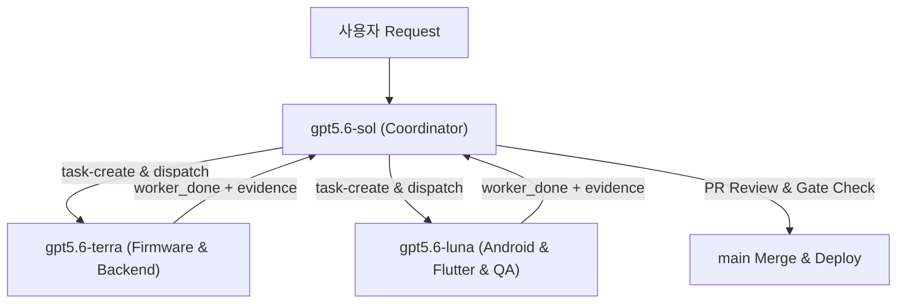

# .orca/ORCA.md — Orca Multi-Agent Orchestration Master Guide
> **Smart Gatekeeper Orca Multi-Agent Architecture & Profile System**
> **Last updated**: 2026-08-09

---

## 1. 개요 (Overview)

이 지침서는 Orca Multi-Agent 오케스트레이션 엔진을 통해 `smart-gatekeeper` 프로젝트를 체계적이고 효율적으로 수행하기 위한 **4대 에이전트 프로파일 (`gpt5.6-sol`, `gpt5.6-terra`, `gpt5.6-luna`, `antigravity`)** 의 역할 분담, 설정 및 실행 워크플로우를 정의합니다.

모든 에이전트는 추론 깊이와 정확도를 극대화하기 위해 **`effort: high`** 로 고정 설정됩니다.

---

## 2. 에이전트 프로파일 구조 (Profile Roles & Responsibilities)

| 프로파일 | 에이전트 이름 | CLI 커맨드 | 주요 담당 영역 | 모델 & Effort | 설정 파일 |
|---|---|---|---|---|---|
| **`gpt5.6-sol`** | **Sol** | `codex --model gpt-5.6-sol -c model_reasoning_effort="high" ...` | 총괄 코디네이터, 아키텍처 설계, 작업 분할(DAG), PR 검토 및 최종 Merge 승인 | `gpt-5.6-sol` (Effort: `high`) | [gpt5.6-sol.md](profiles/gpt5.6-sol.md) |
| **`gpt5.6-terra`** | **Terra** | `codex --model gpt-5.6-terra -c model_reasoning_effort="high" ...` | ESP32-C6 펌웨어 (C++/PlatformIO/GATT/ToF/Relay) & 백엔드 (FastAPI/DB/MQTT/ACL Push) | `gpt-5.6-terra` (Effort: `high`) | [gpt5.6-terra.md](profiles/gpt5.6-terra.md) |
| **`gpt5.6-luna`** | **Luna** | `codex --model gpt-5.6-luna -c model_reasoning_effort="high" ...` | Android Native (Kotlin/WorkManager/BLE Wake) & Flutter Thin UI & QA/E2E Fault Injection | `gpt-5.6-luna` (Effort: `high`) | [gpt5.6-luna.md](profiles/gpt5.6-luna.md) |
| **`antigravity`** | **Antigravity** | `agy --effort high` | 시니어 풀스택 리드 & 크로스레이어 해결 / 비상 태스크 인수 직행 실행 | 실행 시 `agy`가 선택한 지원 모델 (Effort: `high`) | [antigravity.md](profiles/antigravity.md) |

> 기본 런처는 Codex에 `workspace-write` sandbox와 `sandbox_workspace_write.network_access=true`를 적용합니다. 파일 쓰기는 작업공간으로 제한하면서 주입된 Orca lifecycle 명령이 로컬 런타임에 연결할 수 있게 합니다. 전용 repository worker는 시작 경쟁을 제거하기 위해 선택적 Apps 기능과 `node_repl` MCP를 비활성화하며 GitHub 작업은 `GITHUB_TOKEN` 기반 CLI를 사용합니다. Antigravity의 permission bypass는 사용하지 않으며, 격리된 워크트리에서 위험을 검토한 작업만 명시적 `-AllowUnsafe`로 무승인 모드를 켭니다. Codex의 `--dangerously-bypass-approvals-and-sandbox`와 `--ask-for-approval`은 함께 사용하지 않습니다.

> `codex --profile`은 `$CODEX_HOME/<name>.config.toml` 계층만 로드하며 Markdown 역할 파일을 받지 않습니다. Codex의 추론 강도는 `--effort`가 아니라 `-c model_reasoning_effort="high"`로 지정합니다. `agy`는 `--effort high`를 지원하지만 Markdown용 `--profile` 옵션은 지원하지 않습니다. 따라서 런처는 역할 문서 bootstrap을 CLI의 최초 argv prompt로 전달하고, `PROFILE_READY`와 최종 `tui-idle`을 확인한 후 Task를 주입합니다.

> 일부 TUI에서는 `dispatch --inject` 성공 뒤 입력란 끝에 정확히 `[Pasted Content N chars]`만 남고 제출되지 않을 수 있습니다. 런처는 Dispatch 직후 5초 동안 이 미제출 표식이 입력 끝에 있는 경우에만 Enter를 한 번 보내며, 표식이 없거나 작업이 이미 진행된 경우에는 입력을 보내지 않습니다.

> Codex TUI가 최초 argv prompt를 처리하기 전에 오류 출력 없이 PowerShell로 종료되면 런처는 그 정확한 터미널만 닫고 새 터미널에서 한 번 재시도합니다. 두 번째 시작도 종료되면 자동 반복하지 않고 실패 처리합니다.

---

## 3. Orca 오케스트레이션 표준 워크플로우

### 3.1 코디네이터 (`gpt5.6-sol`) 실행 수칙
1. **Run & Task 생성**: `orca orchestration run-create` 및 `task-create`로 작업 명세 정의
2. **워커 터미널 디스패치**:
   - `gpt5.6-terra` 워커 실행: `.orca/scripts/launch_profiles.ps1 -Profile gpt5.6-terra -TaskID <task_id>`
   - `gpt5.6-luna` 워커 실행: `.orca/scripts/launch_profiles.ps1 -Profile gpt5.6-luna -TaskID <task_id>`
3. **모니터링**: `orca orchestration check --wait --types worker_done,escalation,question --timeout-ms 60000 --json`을 rolling window로 반복합니다. timeout 또는 `state: ready`는 완료가 아닙니다.
4. **완료 처리**: 각 `worker_done`을 검토한 뒤 `orca orchestration worker-release --dispatch <dispatch_id> --json` 또는 즉시 재사용을 결정하고, Delivery를 처리한 뒤 `orca orchestration check --ack <delivery_id> --json`으로 ACK합니다.
5. **검증 & 병합**: 로컬/CI/물리 증거를 분리하고, 독립 리뷰와 사용자 병합 권한이 모두 있을 때만 병합합니다. 구현 워커가 자신의 PR을 승인하거나 자동 병합하지 않습니다.

### 3.2 워커 (`gpt5.6-terra`, `gpt5.6-luna`) 공통 작업 수칙

1. **작업 전 지침 이수**: `AGENTS.md`, `wiki/index.md`, 최신 `wiki/log.md`, 관련 wiki 문서 필독
2. **코드 변경 및 검증**: 담당 파트 수정 후 관련 unit test / build 실행 (Host C++, Python, Flutter, PlatformIO)
3. **지식베이스 동기화**: `wiki/` 문서 업데이트 및 `wiki/log.md` Append-only 기록
4. **`worker_done` 송신**: 활성 Dispatch가 주입한 lifecycle preamble의 명령 전체가 유일한 권위입니다. 저수준 staged Dispatch는 pane identity를 대신해 `--from`과 `--dispatch-capability`를 주입할 수 있고, supervised worker는 이를 생략할 수 있으므로 문서 예시나 과거 명령에서 플래그를 추가·삭제·재구성하지 않습니다. 주입된 명령의 placeholder만 실제 3문장 요약(무엇을 했는지, 무엇을 확인했는지, 무엇이 남았는지)과 정확한 결과 값으로 바꿔 exactly one `worker_done`을 보냅니다.

---

## 4. 핵심 안전 불변 조건 (Safety Invariants)

1. **2단계 승인 게이트 구조 유지**:
   - `G0-SW` (소프트웨어 Release Candidate 게이트): 정확한 후보 SHA와 현재 증거 묶음에 대해 검증된 경우에만 `passed`; 그 외에는 `pending / fail-closed`
   - `G0-HW` (물리 장비 검증 게이트): 실기기 연결 전까지 상시 차단 (`pending / fail-closed`)
2. **OTA P0 비회귀 계약**:
   - 모바일 앱 업데이트 매니저 및 Target dual-slot rollback 경로 독립성 유지
3. **중복 ARM 방지**:
   - Hardwareless GATT 로컬 인증과 Legacy REST Pre-arm 간 인터락 유지
