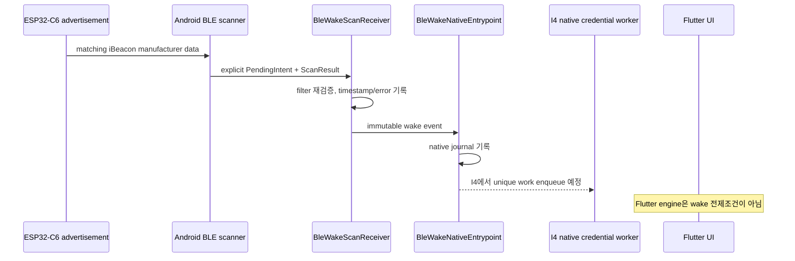

# ADR: Android OS-managed BLE wake

> 작성일: 2026-08-01
> 상태: **코드 PoC 승인, Samsung 실기기 Gate 미통과**
> 추적: GitHub [#14](https://github.com/ks-house/smart-gatekeeper/issues/14), Epic [#13](https://github.com/ks-house/smart-gatekeeper/issues/13)
> P0 불변조건: [모바일 앱·Target OTA 신뢰성 계약](ota_reliability_contract.md)

## 1. 결정

Android 8.0(API 26) 이상에서 기준 wake 경로로 filtered
`BluetoothLeScanner.startScan(filters, settings, PendingIntent)`를 선택한다. 시스템이
matching scan result를 명시적 `PendingIntent`로 전달하면
`BleWakeScanReceiver`가 Flutter engine이나 기존 foreground scanner를 시작하지 않고
native entrypoint를 호출한다.

이 결정은 **기준 경로 선정과 측정 가능한 PoC**에 한정된다. 운영 전환, legacy scanner
비활성화, BLE GATT 인증은 각각 #17 이후 작업이며 Samsung 운영 기기의 화면 OFF·Activity
종료·process kill·재부팅 반복 측정 전에는 #14를 완료로 보지 않는다.

## 2. 후보 비교

| 후보 | process 비실행 wake | 현재 광고 호환 | 사용자 절차 | 주요 위험 | 결정 |
|---|---|---|---|---|---|
| Filtered scan + `PendingIntent` | API 26+ 명시적 receiver 진입 | 현재 iBeacon manufacturer data 사용 | 기존 Nearby/위치 권한 | OEM delivery 지연·누락, 후속 background work 제한 | **선정** |
| Companion Device Manager + `CompanionDeviceService` | association 후 system bind | 현재 비고정 BLE 주소·iBeacon-only 계약은 불충분 | system association UX 필요 | 주소 안정성/bonding, API별 presence 계약 변화, Target 변경 선행 | 보류 |
| AltBeacon callback + Flutter FGS | service가 생존할 때만 | 호환 | 기존 권한·배터리 예외 | Flutter/FGS/OEM kill이 정상 경로 병목 | baseline/rollback만 유지 |

Android 공식 문서는 PendingIntent scan을 API 26에 추가했고, 결과·callback type·error를
`BluetoothLeScanner` extras로 전달한다고 명시한다. 또한 unfiltered scan은 화면 OFF 때
중지될 수 있으므로 정확한 `ScanFilter`가 필요하다.

- [BluetoothLeScanner API](https://developer.android.com/reference/android/bluetooth/le/BluetoothLeScanner)
- [Bluetooth permissions](https://developer.android.com/develop/connectivity/bluetooth/bt-permissions)
- [CompanionDeviceService API](https://developer.android.com/reference/android/companion/CompanionDeviceService)
- [Background task restrictions](https://developer.android.com/develop/background-work/background-tasks/bg-work-restrictions)

CDM은 association된 기기의 presence에 강한 system 계약을 제공하지만 현재 Target은 고정
association identity나 bonding 계약이 없다. Android 12~15 주소 기반 API와 Android 16+
presence request 변화까지 동시에 수용하려면 Target·등록 UX가 먼저 바뀌어야 하므로 이번
PoC의 단순 rollback 후보로 남긴다.

## 3. advertisement/filter contract

현재 Target의 iBeacon contract를 Wave 0에서 변경하지 않는다.

| 필드 | 값 | filter 포함 |
|---|---|---|
| AD type | Manufacturer Specific Data (`0xFF`) | platform parser가 분리 |
| company ID | Apple `0x004C` | `setManufacturerData()` 첫 인자 |
| iBeacon type/length | `02 15` | 포함 |
| proximity UUID | `a1b2c3d4-e5f6-7890-abcd-ef1234567890` | 포함 |
| major/minor | Target 운영 값 | 제외 |
| measured power | 동적 설정 | 제외 |

`ScanFilter`에 전달하는 company ID 이후 data와 mask는 다음과 같다.

```text
data = 02 15 A1 B2 C3 D4 E5 F6 78 90 AB CD EF 12 34 56 78 90
mask = FF FF FF FF FF FF FF FF FF FF FF FF FF FF FF FF FF FF
```

major/minor와 measured power는 filter에서 제외하므로 기존 동적 Tx power와 Target별 값이
OS wake identity를 깨지 않는다. UUID byte order는 문자열의 network/MSB-first 순서다.
`src/main.cpp`의 실제 air payload byte order는 Samsung 시험 전에 nRF Connect 또는 raw
scan으로 반드시 대조한다.

향후 #18이 connectable GATT service identifier를 추가해도 N/N-1 기간에는 이 iBeacon
prefix를 함께 유지한다. filter identifier를 바꾸는 release는 구 앱과 새 Target 사이의
dual-advertising/rollback 증거 없이 배포할 수 없다.

## 4. native entrypoint 계약



현재 PoC entrypoint는 다음을 보장한다.

- receiver는 `android:exported=false`이며 OS가 보유한 explicit `PendingIntent`만 받는다.
- Android 12+ PendingIntent는 scanner가 result extras를 채워야 하므로 `FLAG_MUTABLE`을
  사용하되 component와 action을 고정해 mutable 범위를 제한한다.
- 결과의 Apple company data와 UUID prefix를 다시 검증한다.
- `ScanResult.timestampNanos`부터 receiver 시작까지 delivery latency, error, result count,
  RSSI, 화면 interactive 여부, process UUID를 native journal과 `BLE_WAKE_POC` logcat에 남긴다.
- Flutter engine, WebView, REST, MQTT, foreground service를 호출하지 않는다.
- 등록 opt-in이 켜진 경우 재부팅과 `MY_PACKAGE_REPLACED` 뒤 native scan을 재등록한다.
- debug APK에만 synthetic command receiver가 존재하며 release manifest에는 노출되지 않는다.

#17의 worker는 이 entrypoint 뒤에서 중복 presence를 병합하고, network constraint 없는
단일 native GATT 작업을 enqueue해야 한다. BroadcastReceiver 안에서 긴 GATT session이나
background service를 직접 시작하면 안 된다. worker timeout/backoff와 expedited work quota
저하는 #17 실기기 시험에서 확정하며, 실행이 보장되지 않으면 사용자 동작 local retry로
fail closed한다.

## 5. 권한·지원 범위

| OS | wake scan 최소 권한 | 비고 |
|---|---|---|
| Android 8~9 | `BLUETOOTH`, `BLUETOOTH_ADMIN`, foreground location | PendingIntent API 26+ |
| Android 10~11 | 위 항목 + `ACCESS_FINE_LOCATION`, background 실행 시 `ACCESS_BACKGROUND_LOCATION` | 위치 서비스 상태도 현장 확인 |
| Android 12+ | runtime `BLUETOOTH_SCAN` | 앱이 물리 근접을 판단하므로 위치 권한은 현재 유지 |
| I4 GATT | Android 12+ `BLUETOOTH_CONNECT` | wake scan 자체의 최소 권한과 구분 |

현재 iBeacon이 필터링될 가능성이 있으므로 `BLUETOOTH_SCAN`에 `neverForLocation`을
선언하지 않는다. PendingIntent receiver 자체에는 FGS나 알림 권한이 필요하지 않으며,
legacy scanner와 I4 GATT가 요구하는 권한은 wake 최소 세트와 별도로 표시해야 한다.

지원 계약:

- 화면 OFF, Home, Activity 종료, OS가 회수한 일반 background process: **지원 목표,
  Samsung Gate pending**
- 재부팅/앱 업데이트: 등록 opt-in 복구 구현, **Samsung Gate pending**
- Android 설정의 force-stop, Android 13+ 활성 앱 `중지`, OEM restricted battery,
  Bluetooth OFF, 권한 회수: **자동 wake 미지원**
- force-stop 뒤에는 사용자가 앱을 명시적으로 다시 열어 stopped state를 해제해야 한다.
  앱은 이를 자동 복구했다고 표시하지 않고 manual local retry/update 화면을 제공해야 한다.

## 6. 하드웨어 없는 자동 검증

### JVM test

Android host unit test는 다음 계약을 검증한다.

- UUID의 exact manufacturer data bytes와 mask
- major/minor/measured power가 달라도 match
- wrong UUID와 truncated payload 거부
- 20회 성공률과 nearest-rank p50/p95/max 집계
- 관측 0건이면 latency를 만들지 않고 pending 유지

```powershell
cd gatekeeper_app
docker compose run --rm flutter-builder bash -lc `
  "flutter pub get && cd android && ./gradlew :app:testDebugUnitTest"
```

### emulator/설치 APK synthetic dispatch

debug APK의 별도 receiver가 동일 native entrypoint/journal/statistics seam에 20개 synthetic
event를 주입한다. 스크립트는 post-install stopped state를 해제하기 위해 앱을 한 번 연 뒤
Home 이동과 일반 process kill을 수행하고, 이후 explicit native broadcast만 전달한다. 이는
receiver가 Flutter engine 생존에 의존하지 않는 경로를 검증하지만 BLE radio, OS scan
delivery, Samsung latency 증거는 아니다.

```powershell
cd gatekeeper_app
./tool/android_ble_wake_hardwareless.ps1 `
  -ApkPath ./build/app/outputs/flutter-apk/app-debug.apk -Trials 20
```

스크립트는 모든 event에 `source=synthetic`을 강제하고 마지막에 다음 경고를 출력한다.

```text
NOTE: this validates only hardwareless dispatch/journal/statistics; it is not Samsung BLE wake evidence.
```

## 7. Samsung 실기기 측정 Gate — PENDING

아래 표의 값은 아직 측정하지 않았다. synthetic test나 host unit test 값을 이 표에 옮기지
않는다. 각 조건은 Samsung 운영 기기에서 **20회 이상** 실행하고 real event
`source=ble_scan`만 집계한다.

| 조건 | 요구 반복 | 현재 반복 | 성공률 | p50 | p95 | max | 상태 |
|---|---:|---:|---:|---:|---:|---:|---|
| 화면 OFF | 20 | 0 | — | — | — | — | **PENDING** |
| Activity 종료 | 20 | 0 | — | — | — | — | **PENDING** |
| 일반 process kill (`am kill`, force-stop 아님) | 20 | 0 | — | — | — | — | **PENDING** |
| 재부팅 후 등록 복구 | 20 | 0 | — | — | — | — | **PENDING** |

측정 절차:

1. 동일 Samsung 기기/OS, 동일 Target, 동일 거리·방향·Tx power를 기록한다.
2. debug APK를 한 번 열어 runtime 권한을 승인하고 native PoC 등록을 실행한다.
3. Target을 충분히 멀리 두어 FIRST_MATCH 상태가 해제된 뒤 각 trial 조건을 만든다.
4. Target을 시험 위치로 이동하고 `BLE_WAKE_POC`의 첫 `source=ble_scan` event를 수집한다.
5. timeout 안에 event가 없으면 실패 1회로 별도 기록한다. 다음 trial 전에 다시 이탈한다.
6. latency는 `ScanResult.timestampNanos`부터 receiver 시작까지의 OS delivery latency다.
   광고가 가시화되기 전 discovery 시간은 포함하지 않으므로 지표명을 바꾸지 않는다.
7. `process_id`, `screen_interactive`, 재부팅 시각을 대조해 조건이 실제로 성립했는지 확인한다.
8. 20회 raw JSON을 보존하고 nearest-rank p50/p95, max, 성공률을 계산한다.

debug APK의 등록·중지·journal dump 명령은 다음과 같다.

```powershell
$component = "com.kshouse.gatekeeper_app/.blewake.BleWakeDebugCommandReceiver"
$action = "com.kshouse.gatekeeper_app.blewake.DEBUG_COMMAND"
adb shell am broadcast -a $action -n $component --es command reset
adb shell am broadcast -a $action -n $component --es command register
adb logcat -s BLE_WAKE_POC:I "*:S"
# 측정 종료 뒤
adb shell am broadcast -a $action -n $component --es command dump
adb shell am broadcast -a $action -n $component --es command stop
```

force-stop은 성공률 시험 대상이 아니라 미지원 계약 확인 대상이다. force-stop 후 broadcast가
오지 않는 결과를 일반 process kill 실패에 섞지 않는다.

## 8. OTA·rollback 영향

- wake receiver/scan 등록은 mobile update manager, APK 다운로드·서명 검증·install UI와
  별도 action/저장소를 사용한다.
- `MY_PACKAGE_REPLACED` 재등록은 업데이트 후 wake PoC를 복구하지만 update 발견·설치를
  이 receiver에 의존시키지 않는다.
- 기존 APK와 foreground scanner는 feature 전환 전까지 유지한다. PoC 등록 실패는 기존
  자동 출입이나 manual update 경로를 제거하지 않는다.
- Target firmware, partition table, dual-slot OTA, rollback mark에는 변경이 없다.
- rollback은 PendingIntent scan을 `stopScan()`으로 해제하고 legacy scanner flag를 유지하는
  방식이다. 구 APK/Target과의 N/N-1 기간에는 current iBeacon filter prefix를 보존한다.
- #23의 mobile OTA reachability, fallback APK 보존, install confirmation 실기기 Gate는 이
  코드 PoC로 통과한 것으로 간주하지 않는다.

## 9. 승인 Gate

현재 상태는 다음과 같다.

- [x] 후보 비교와 기준 방식 선정
- [x] exact advertisement/filter byte contract
- [x] Flutter-independent native receiver/entrypoint PoC
- [x] hardwareless unit/synthetic 재현 절차
- [x] force-stop/OEM restricted 미지원 계약
- [x] OTA control plane 분리와 rollback 정의
- [ ] Samsung 화면 OFF 20회 성공률·p50/p95/max
- [ ] Samsung Activity 종료 20회
- [ ] Samsung 일반 process kill 20회
- [ ] Samsung 재부팅 20회와 등록 복구
- [ ] #23 mobile OTA-G1/G2/G3 비회귀 증거

따라서 PR은 #14를 자동 close하지 않으며 실기기 Gate가 채워질 때까지 draft/미완료 상태로
관리한다.

## 10. Issue #17 native worker integration

The production-default-OFF GATT worker consumes this ADR's `BleWakeNativeEntrypoint` only after the
existing wake event has been recorded. Work scheduling is native and does not start or require a
Flutter engine. The original wake journal remains redacted. The device address required for GATT is
never placed in WorkManager `Data`: it is encrypted under a non-exportable AndroidKeyStore AES-GCM
key in `noBackupFilesDir` and deleted at the pre-proof uncertainty boundary. Duplicate delivery of
one OS scan timestamp/callback identity maps to one Keystore-HMAC durable wake even after restart or
terminal completion.

Legacy beacon scanning and native GATT are mutually exclusive through the cryptographically signed,
anti-replay, unexpired, exact-Keystore-key-bound remote flag plus a cross-process kernel lease
described in [android_gatt_worker.md](android_gatt_worker.md). Live enable actively stops legacy
ranging/monitoring; expiry or authenticated rollback disables native proof before legacy reacquires.
This integration does not satisfy the Samsung 20-run gates above and does not weaken the independent
mobile OTA or authenticated `manual_remote` paths.

## 11. 2026-08-25 physical exact-filter diagnosis

The production-signed Android `1.0.0-g7c2764a` replacement install preserved
its local Keystore credential and registered the OS `PendingIntent` scan with
the exact Apple company ID `0x004C`, iBeacon type `02 15` and Gatekeeper UUID.
All required Bluetooth/location permissions were granted, Bluetooth was ON,
and the package was battery-whitelisted. Android nevertheless reported zero
results for that exact filter while an unfiltered Bluetooth cache saw the
named Target. No `source=ble_scan` event was delivered, so no encrypted locator
could be recorded and manual retry truthfully returned `TARGET_UNAVAILABLE`.

Source tracing found an on-air contract violation in the Target rather than an
Android registration or permission failure. The pinned pioarduino
`BLEBeacon::setManufacturerId()` swaps its argument before the packed structure
is returned as raw advertising data. Passing `0x004C` therefore emits `00 4C`;
the pinned framework example passes `0x4C00`, which emits the standard iBeacon
company bytes `4C 00` consumed by Android's manufacturer ID `0x004C` filter.
The Target now passes `0x4C00`, and a source regression rejects the old setter
argument. The exact Android filter remains unchanged and fail-closed.

The corrected personal-production image compiles against Arduino 3.3.9 for the
physical 16 MB N16 layout at 1,779,430 bytes, leaving 5,560,602 bytes in either
7,340,032-byte OTA slot. This is source/build evidence only. CI production
signing, NAS readback, Target inactive-slot install/reboot, non-zero exact scan,
locator creation and GATT challenge/proof/result remain the connected Gate.

## 12. Issue #134 activation and dispatch bound

The personal native-GATT enable operation now attempts `register()` in the same
native control call, and disable calls `stop()`. Registration health is derived
from the persisted opt-in plus current scan/connect/location permissions and
Bluetooth/scanner availability, rather than from the persisted bit alone. The
first presence work is expedited on Android 12+ with a quota-safe fallback;
Android 8 through 11 retain the existing regular work request, retries are
delayed normally, and work older than 45 seconds fails closed before proof.

This connects setup to the selected OS wake mechanism and bounds stale work, but
does not change the Samsung Gate above. `handsFreeReady`, wake status,
presence-to-dispatch and presence-to-Target-ARMED measurements are software
observability until a release APK is installed on the phone and repeated with
screen off, Activity/process background, reboot, sensor and relay.
