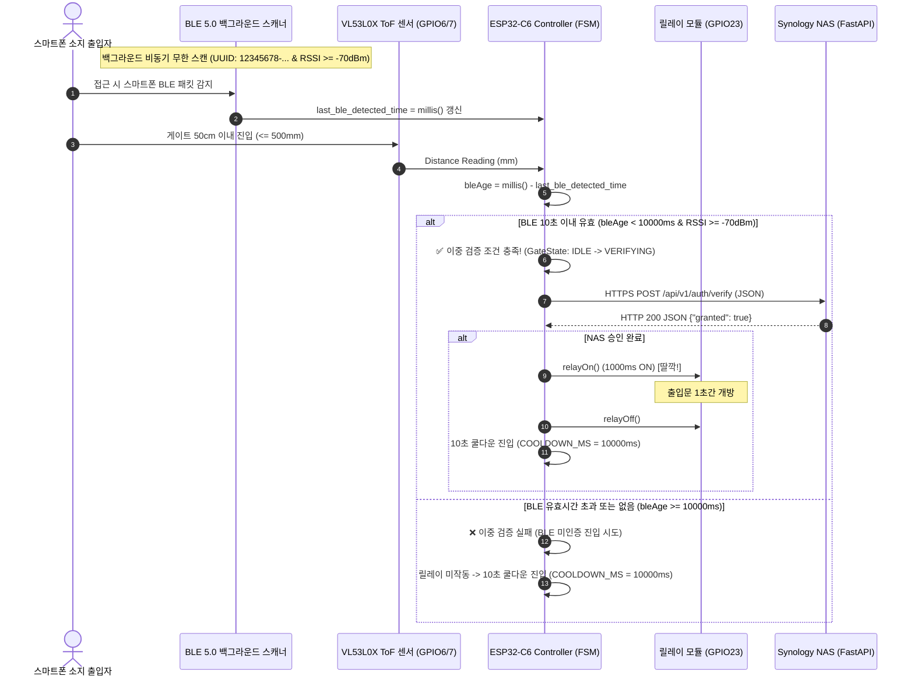

# architecture.md — 시스템 아키텍처 및 로드맵
> Last updated: 2026-07-24 (Step 4 BLE 5.0 & Walk-through 이중 검증 완료 🟢)

---

## 1. 시스템 아키텍처 개요

`smart-gatekeeper`는 ESP32-C6 (RISC-V) 기반 출입 통제 컨트롤러로, BLE 5.0 비동기 스마트폰 스캔 ➔ ToF 레이저 센서 감지 ➔ 이중 검증(Walk-through) ➔ 시놀로지 NAS HTTPS 자격 검증 API ➔ 릴레이 스위칭 ➔ MQTTS HA Auto-Discovery ➔ GitHub CI/CD SFTP OTA 파이프라인으로 구현되어 있습니다.

```
┌────────────────────────────────────────────────────────────────────────────────────────┐
│                                   smart-gatekeeper                                     │
│                                                                                        │
│  [BLE 5.0 Scanner] ───┐                                                                │
│  (RSSI >= -70dBm)     ├─► [Walk-through 이중 검증] ─► [HTTPS API] ─► [Relay (GPIO23)]   │
│  [ToF Sensor] ────────┘    (거리<=50cm & BLE 10초이내)   (tworimpa:4442)     (도어락 ON) │
│                                       │                         │                      │
│                 ┌─────────────────────┼─────────────────────────┘                      │
│                 ▼                     ▼                                                │
│       [WiFi CaptivePortal]    [MQTTS HA Discovery & OTA]                               │
│       (SmartGatekeeper-Setup)  (tworimpa:4883 / GitHub CI)                             │
└────────────────────────────────────────────────────────────────────────────────────────┘
```

---

## 2. 전체 통합 시퀀스 다이어그램 (Sequence Diagram)

### 2.1. Step 4 BLE + ToF 이중 검증 (Walk-through) 출입 통제 시퀀스



---

## 3. 단계별 로드맵 및 상태

| 단계 | 이름 | 목표 | 상태 |
|------|------|------|------|
| **Step 1** | Local PoC | ToF + Relay 단독 및 로컬 연동 검증 | 🟢 **완료** (2026-07-24) |
| **Step 2** | 백엔드 구축 | 시놀로지 NAS FastAPI + MariaDB Docker 구축 & HTTPS API 검증 | 🟢 **완료** (2026-07-24) |
| **Step 3** | WiFi + NAS 연동 | ESP32-C6 WiFi/CaptivePortal + NAS HTTPS 자격검증 및 릴레이 연동 | 🟢 **완료** (2026-07-24) |
| **Step 4** | BLE + 이중 검증 | BLE 5.0 스캔, ToF 이중 검증(Walk-through), MQTTS HA, OTA 파이프라인 | 🟢 **완료** (2026-07-24) |
| **Step 5** | 프로덕션 | PCB 양산 설계, 하우징 케이스 제작 | 🔲 미시작 |
