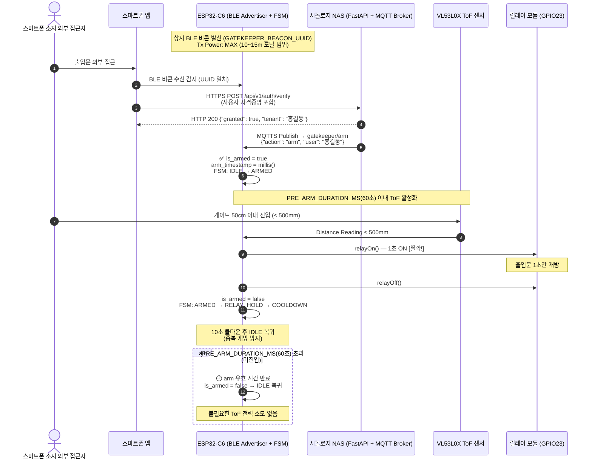
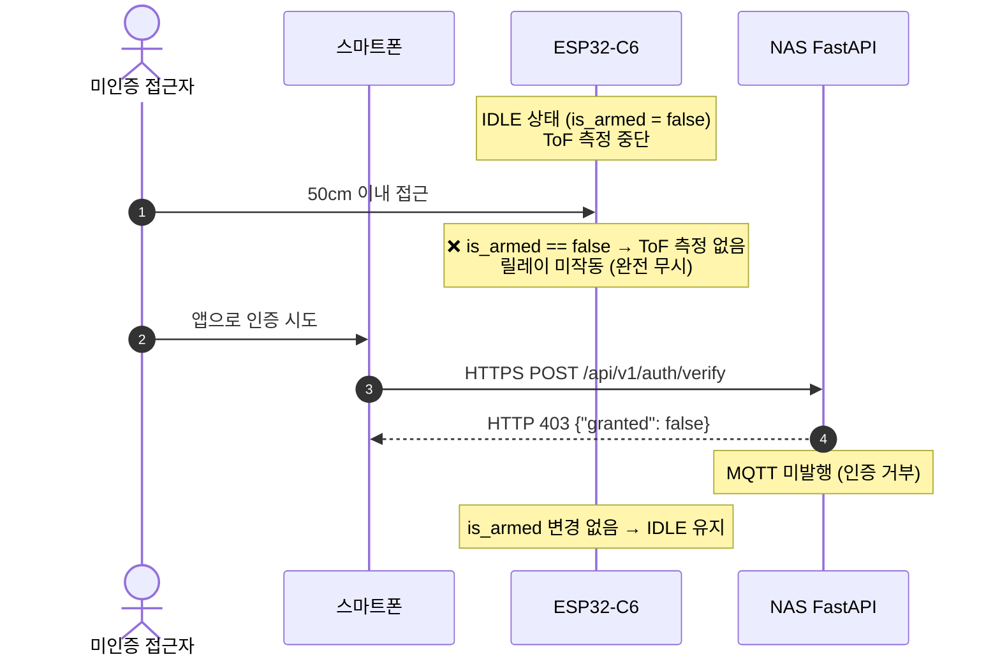

# architecture.md — 시스템 아키텍처 및 로드맵
> Last updated: 2026-07-25 (v2.0 BLE Beacon Advertiser + MQTT Pre-arm 아키텍처 전면 개편 🟢)

---

## 1. 시스템 아키텍처 개요

`smart-gatekeeper`는 ESP32-C6 (RISC-V) 기반 **외부 진입 전용(Entry Only)** 스마트 출입 통제 컨트롤러입니다.

**v2.0 핵심 설계 철학:**
- **역할 반전**: ESP32-C6가 스캐너(Scanner) 에서 **비콘 발신자(Advertiser)** 로 전환
- **스마트폰 배터리 최적화**: 기존 스마트폰이 BLE 패킷을 항상 광고해야 했던 방식 → 스마트폰이 ESP32 비콘을 수신하는 방식으로 배터리 소모 대폭 절감
- **MQTT 사전 승인(Pre-arming)**: NAS 백엔드가 인증을 완료한 후 MQTT로 ESP32에 직접 통보 → ToF 센서 활성화 구조
- **외부 진입 전용 동선**: 출입문 외부에 비콘 발신, 인증된 사용자만 ToF 감지 트리거 가능

```
┌─────────────────────────────────────────────────────────────────────────────────────┐
│                                  smart-gatekeeper v2.0                               │
│                                                                                       │
│  [BLE 5.3 Advertiser] ────► 외부 스마트폰이 비콘 수신                               │
│  (GATEKEEPER_BEACON_UUID)     │                                                       │
│                               ▼                                                       │
│                    스마트폰 → NAS HTTPS 인증 요청                                     │
│                               │                                                       │
│                    NAS ──MQTT──► [gatekeeper/arm 토픽 수신]                          │
│                               │                                                       │
│                    is_armed = true (PRE_ARM_DURATION_MS: 60초)                        │
│                               │                                                       │
│                    [VL53L0X ToF] ──50cm 감지──► [Relay GPIO23]                       │
│                                                  (도어락 1초 ON)                     │
│                                                       │                               │
│                                               COOLDOWN → IDLE                         │
│                                                                                       │
│  [WiFi CaptivePortal]    [MQTTS HA Discovery & OTA]                                  │
│  (SmartGatekeeper-Setup)  (NAS:4883 / GitHub CI)                                     │
└─────────────────────────────────────────────────────────────────────────────────────┘
```

---

## 2. v1.x vs v2.0 아키텍처 비교

| 항목 | v1.x (BLE 스캐너 방식) | v2.0 (BLE Beacon Advertiser 방식) |
|------|----------------------|----------------------------------|
| ESP32-C6 BLE 역할 | 스캐너 — 스마트폰 패킷 지속 감시 | **상시 비콘 발신자** |
| 스마트폰 역할 | 단순 피탐지 (BLE 광고 필수) | **비콘 수신 → NAS 인증 요청** |
| 인증 주체 | ESP32-C6 → NAS HTTPS POST | **스마트폰 → NAS → MQTT → ESP32** |
| ToF 활성 조건 | 상시 측정 | **MQTT Pre-arm 후 60초 한정** |
| 스마트폰 배터리 | 항상 BLE 광고 필요 → 소모 큼 | 비콘 수신 시에만 반응 → **대폭 절감** |
| 보안 레이어 | BLE RSSI 임계값 기반 근접 판단 | NAS 서버 인증 → MQTT 암호화 채널 |
| 설치 방향 | 양방향 | **외부 진입 전용 단방향** |

---

## 3. 전체 통합 시퀀스 다이어그램

### 3.1. v2.0 BLE Beacon + MQTT Pre-arm + ToF 출입 통제 시퀀스



### 3.2. NAS 인증 거부 또는 MQTT 미수신 시나리오



---

## 4. BLE Beacon 설계 상세

### 4.1. 비콘 식별자

```cpp
// include/config.h
constexpr const char* GATEKEEPER_BEACON_UUID = "a1b2c3d4-e5f6-7890-abcd-ef1234567890";
```

- ESP32-C6 BLE 5.3 전용 비콘 광고 패킷에 128-bit UUID 포함
- Tx Power: `ESP_PWR_LVL_P9` (+9 dBm, 최대 출력) — 10~15m 야외 도달 목표
- 비콘 광고 인터벌: 100ms (반응성과 전력 균형)
- Non-connectable Advertising (연결 시도 불가, 보안 강화)

### 4.2. Tx Power 설정 (NimBLE)

```cpp
// NimBLE Advertiser 최대 출력 설정
NimBLEAdvertising* pAdv = NimBLEDevice::getAdvertising();
NimBLEDevice::setPower(ESP_PWR_LVL_P9); // +9dBm 최대 출력
```

---

## 5. MQTT Pre-arm 프로토콜

### 5.1. 구독 토픽

```
gatekeeper/arm
```

### 5.2. 메시지 페이로드 (NAS → ESP32)

```json
{"action": "arm", "user": "홍길동", "tenant_id": 1}
```

- ESP32는 `action == "arm"` 또는 단순 문자열 `"arm"` 모두 허용 (fallback 처리)
- `is_armed = true` 설정, `arm_timestamp = millis()` 기록
- 유효 시간: `PRE_ARM_DURATION_MS = 60000ms (60초)`

### 5.3. Pre-arm 상태 FSM

```
IDLE ──[MQTT arm 수신]──► ARMED (60초 타이머 시작)
  │                           │
  │                    [ToF ≤ 500mm 감지]
  │                           │
  │                      RELAY_HOLD (1초)
  │                           │
  │                       COOLDOWN (10초)
  │                           │
  └───────────────────────────┘ (IDLE 복귀)

ARMED ──[60초 만료, 미진입]──► IDLE (자동 만료)
```

### 5.4. Home Assistant MQTT Auto-Discovery 엔티티 자동 등록 (22개)

ESP32-C6 보드 부팅 및 MQTT 연결 시 Home Assistant 브로커(`homeassistant/<component>/smart_gatekeeper_01/<object_id>/config`)로 22개 엔티티 설정을 자동 발행하여 대시보드에 자동 등록됩니다.

| 분류 | Object ID | 엔티티 명칭 | 토픽 / 템플릿 / 범위 |
|------|-----------|--------------|----------------------|
| **Button** | `open_gate` | [Gatekeeper] 출입문 원격 개방 | `smart-gatekeeper/cmd` (`{"command":"open_gate"}`) |
| **Button** | `trigger_ota` | [Gatekeeper] 펌웨어 무선 업데이트 | `smart-gatekeeper/cmd` (`{"command":"ota_update"}`) |
| **Button** | `reboot` | [Gatekeeper] 장치 재부팅 | `smart-gatekeeper/cmd` (`{"command":"reboot"}`) |
| **Sensor** | `distance` | [Gatekeeper] 초음파 감지 거리 (mm) | `smart-gatekeeper/status` (`distance_mm`) |
| **Sensor** | `distance_cm` | [Gatekeeper] 초음파 감지 거리 (cm) | `smart-gatekeeper/status` (`distance_cm`) |
| **Sensor** | `state` | [Gatekeeper] 게이트키퍼 동작 상태 | `smart-gatekeeper/status` (`state`) |
| **Sensor** | `ip` | [Gatekeeper] IP 주소 | `smart-gatekeeper/status` (`ip`) |
| **Sensor** | `arm_remaining_s` | [Gatekeeper] Pre-arm 잔여 시간 | `smart-gatekeeper/status` (`arm_remaining_s`) |
| **Sensor** | `wifi_rssi` | [Gatekeeper] Wi-Fi 신호 강도 (RSSI) | `smart-gatekeeper/status` (`wifi_rssi`) [진단] |
| **Sensor** | `free_heap` | [Gatekeeper] Free Heap 메모리 | `smart-gatekeeper/status` (`free_heap`) [진단] |
| **Sensor** | `uptime_s` | [Gatekeeper] 시스템 가동 시간 | `smart-gatekeeper/status` (`uptime_s`) [진단] |
| **Sensor** | `firmware` | [Gatekeeper] 펌웨어 버전 | `smart-gatekeeper/status` (`firmware`) [진단] |
| **Binary Sensor** | `door_binary` | [Gatekeeper] 도어 개방 여부 | `smart-gatekeeper/status` (`state == 'RELAY_HOLD'`) |
| **Binary Sensor** | `pre_armed` | [Gatekeeper] Pre-arm 활성화 상태 | `smart-gatekeeper/status` (`is_armed`) |
| **Number** | `config_tx_power_num` | [Gatekeeper] BLE Tx Power 설정 | `gatekeeper/config/tx_power` (-6 ~ 9 dBm) |
| **Number** | `config_dist_thresh_num` | [Gatekeeper] 초음파 감지 기준 거리 | `gatekeeper/config/distance_threshold` (20 ~ 200 cm) |
| **Number** | `config_duration_num` | [Gatekeeper] Pre-arm 유효 시간 | `gatekeeper/config/duration` (5 ~ 300 s) |
| **Number** | `config_relay_cooldown_num`| [Gatekeeper] 릴레이 쿨다운 시간 | `gatekeeper/config/relay_cooldown` (1 ~ 30 s) |
| **Config Sensor** | `cfg_tx_power` | [Gatekeeper] [설정] BLE Tx Power | `gatekeeper/config/state` (`tx_power`) |
| **Config Sensor** | `cfg_distance_thresh` | [Gatekeeper] [설정] 초음파 기준 거리 | `gatekeeper/config/state` (`distance_threshold_cm`) |
| **Config Sensor** | `cfg_prearm_duration` | [Gatekeeper] [설정] Pre-arm 유효 시간 | `gatekeeper/config/state` (`duration_ms / 1000`) |
| **Config Sensor** | `cfg_relay_cooldown` | [Gatekeeper] [설정] 릴레이 쿨다운 시간 | `gatekeeper/config/state` (`relay_cooldown_ms / 1000`) |

---

## 6. 실외 설치 주의사항 (태양광 ToF 간섭 대책)

> ⚠️ **CRITICAL: 직사광선 IR 간섭 경고**

VL53L0X는 940nm 근적외선(Near-IR) 레이저를 사용합니다. 태양광은 940nm 대역을 포함한 광범위한 IR을 방출하므로, **직사광선 환경에서 ToF 센서가 최대 범위 측정값(65535mm)을 반환하거나 심각한 오검지를 유발할 수 있습니다.**

### 6.1. 물리적 차폐 설계 (필수)

| 대책 | 설명 | 권장 |
|------|------|------|
| **챙(Visor) 설계** | 센서 전면에 5~10cm 길이의 불투명 챙 설치 | ⭐ 최우선 |
| **터널형 하우징** | 센서를 원통/사각 터널 내부에 매립 (직사광 완전 차단) | ⭐ 적극 권장 |
| **북향/그늘 설치** | 직사광선이 센서 정면에 닿지 않는 방향으로 배치 | 설치 계획 시 반영 |
| **측면 설치** | 문 옆 벽면에 수평 방향 설치 (햇빛 방향 회피) | 대안 |

### 6.2. 소프트웨어 보완 (펌웨어 적용)

```cpp
// 65535 sentinel 및 타임아웃 반드시 체크
uint16_t mm = sensor.readRangeContinuousMillimeters();
if (mm == 65535 || sensor.timeoutOccurred()) {
    // 유효하지 않은 읽기 — 무시 처리
    return;
}
```

- VL53L0X Long Range 모드 사용 시 태양광 환경에서 신뢰도 저하 → **Standard 모드 유지**
- `sensor.setSignalRateLimit(0.25)` 기본값 유지 (노이즈 필터링)
- **권장 최대 측정 거리**: 실내 200cm / **실외 직사광 환경 50cm 이내** (이미 문 통과 감지에 최적)

### 6.3. 케이스 설계 가이드라인

```
      ┌──────────┐
      │   챙(Visor) 10cm 이상 │ ◄── 불투명 재질 (ABS, 알루미늄)
      └──────────┘
           │
      ┌────▼────┐
      │ VL53L0X │ ◄── 터널 깊이 최소 5cm
      │ ToF 센서 │
      └─────────┘
      ↑ 설치 방향: 문 외부, 지면과 평행, 북향 또는 그늘
```

---

## 7. 단계별 로드맵 및 상태

| 단계 | 이름 | 목표 | 상태 |
|------|------|------|------|
| **Step 1** | Local PoC | ToF + Relay 단독 및 로컬 연동 검증 | 🟢 **완료** (2026-07-24) |
| **Step 2** | 백엔드 구축 | 시놀로지 NAS FastAPI + MariaDB Docker 구축 & HTTPS API 검증 | 🟢 **완료** (2026-07-24) |
| **Step 3** | WiFi + NAS 연동 | ESP32-C6 WiFi/CaptivePortal + NAS HTTPS 자격검증 및 릴레이 연동 | 🟢 **완료** (2026-07-24) |
| **Step 4** | BLE + 스마트 쿨다운 | BLE 5.0 선인증, ToF 이중 검증(Walk-through), 상주 시 동적 쿨다운 리셋 | 🟢 **완료** (2026-07-24) |
| **Step 5 v2.0** | BLE Beacon + Pre-arm | ESP32 비콘 발신, 스마트폰→NAS→MQTT 인증 경로, Pre-arm FSM | 🟡 **진행 중** (2026-07-25) |
| **Step 6** | 프로덕션 | PCB 양산 설계, 실외 하우징(챙/터널형) 케이스 제작 | 🔲 미시작 |
