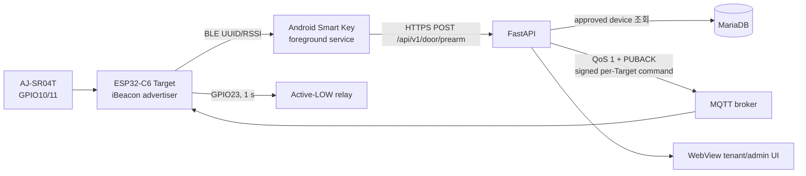
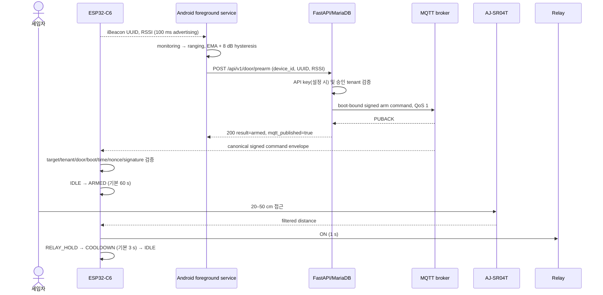

# architecture.md — 현재 시스템 아키텍처
> Last updated: 2026-09-04 (bounded Target recovery and broker-routed HA Activity receipt contract added; deployment and physical door evidence pending)
>
> 저장소 구현과 현장 배포 상태의 차이는 [project_status.md](project_status.md)를 먼저 확인한다.

## 1. 범위

현재 시스템은 **외부 진입 전용**입니다. ESP32-C6 Target이 고정 iBeacon을 발신하고 Android 앱이 세입자 기기를 식별하여 Pre-arm을 요청합니다. 인증과 MQTT 전달이 완료된 뒤에만 Target이 초음파 접근을 문 열기 조건으로 사용합니다.



## 2. 정상 출입 시퀀스



서버는 사용자 검증이 성공해도 MQTT PUBACK을 받지 못하면 503을 반환합니다. 앱도 HTTP 200뿐 아니라 `result=armed`와 `mqtt_published=true`를 모두 요구합니다.

### 2.1 Personal-production core acceptance path

The sequence above remains the legacy rollback path. The current personal
production profile deliberately sets `ACL_LEGACY_DEVICE_LOOKUP_ENABLED=false`;
therefore raw device-ID `/api/v1/door/prearm` authority is retired and a 410
response is expected rather than a core-use-case failure.

Current enrollment and access have two coupled but independently observable
phases:

1. Android generates a P-256 credential in AndroidKeyStore and sends only its
   public material to authenticated HTTPS
   `/api/v1/acl/personal/enroll`.
2. The Backend stores the credential/grant, creates a signed ACL snapshot,
   publishes it through exact per-Target MQTTS and records the Target's exact
   `APPLIED` ACK.
3. After that durable control-plane agreement, Android action 1 authenticates
   locally over GATT and moves the Target to `ARMED`; action 2 authenticates in
   a separate GATT session and moves it directly to `RELAY_HOLD`.

The Backend is therefore required for identity enrollment, revocation, signed
ACL delivery and operational readiness, but it is intentionally not a
real-time dependency of each local door opening while the accepted ACL lease
is valid. A production core acceptance claim must combine all of the following
evidence instead of treating one subsystem as a substitute for the others:

- new-stack `status=deployed`, exact `source_sha`, loopback/public `/ready=200`
  with DB/schema/MQTTS/control/ACL checks and `legacy_prearm_retired=true`;
- exact personal tenant/door/Target, active credential/grant and latest signed
  ACL snapshot/APPLIED-ACK correlation from the read-only NAS verifier;
- connected mobile terminal action-1 `ARMED`, followed by action-2 `OPENED`,
  plus Target relay-command ON and timer-bound OFF without reset.

Those three results prove the implemented Backend/mobile/Target software and
control path. Relay contact voltage, actuator load, ultrasonic threshold,
actual door motion and repeated Samsung/OEM screen-off behavior remain separate
physical acceptance Gates until directly measured.

### 2.2 Authenticated post-ARM evidence path

`action-1 RESULT OK`와 기존 앱의 `출입 준비 완료`는 credential proof와 Target `ARMED`까지의
결과다. Sensor/relay 완료와 다음 인증 가능 상태는 별도 경로로 확인한다.

```mermaid
sequenceDiagram
  participant A as Android app
  participant T as ESP32-C6 Target
  participant M as MQTTS broker
  participant B as Backend collector
  participant H as Admin / HA

  A->>T: action 1 + exact UUIDv4 session + Keystore proof
  T->>T: actor ref 생성, ARMED
  T-->>A: RESULT OK (출입 준비 완료)
  T->>T: sensor → relay ON → relay OFF → cooldown → IDLE
  T-->>M: HMAC-signed events + signed terminal/status
  M-->>B: exact Target topics
  B->>B: HMAC, boot/revision, exact session/actor 검증
  B-->>H: actor-labelled admin timeline / allow-listed HA status
  A->>B: exact session + AndroidKeyStore read proof
  B-->>A: stage; fresh IDLE+relay OFF일 때 next_auth_ready
```

Target은 raw credential ID 대신 door/session-bound HMAC `credential_ref`만 내보낸다. Backend는
현재 credential/tenant projection과 유일하게 일치할 때만 관리자 화면에 이름·호수를 붙이고,
모바일에는 요청한 credential과 exact session에 해당하는 행만 반환한다. Global Target 상태가
다른 사람이나 이전 session으로 새지 않도록 terminal actor ref와 session이 모두 맞아야 status를
결합한다.

이 경로에서 `next_auth_ready`는 동일 boot의 signed terminal, fresh `IDLE`, relay command OFF와
configured OFF pin level을 뜻한다. 새 BLE scan 또는 인증을 자동 시작시키는 신호가 아니며,
door-contact가 없는 현재 하드웨어에서 실제 문짝 개방·폐쇄를 확인하는 신호도 아니다.
각 mobile poll은 새 AndroidKeyStore nonce를 사용하고 Backend가 서명 검증 직후 기존 durable
credential nonce ledger에서 한 번만 소비한다. 같은 20초 read proof의 재전송은 상태를 다시 읽지
못한다.

## 3. Target 펌웨어

### 3.1 상태 머신

```text
IDLE --MQTT arm--> ARMED --valid ultrasonic--> RELAY_HOLD --1 s--> COOLDOWN --configured delay--> IDLE
                         \--arm expiry-----------------------------------------------> IDLE
```

- ARMED: 기본 60초, NVS/MQTT/Web 설정 가능
- 거리: 5개 중앙값 필터, 20 cm 미만 무시, 기본 50 cm 임계값
- manual remote: 같은 signed per-Target command plane의 `manual_remote`; IDLE interlock과 관리자 승인 계약을 유지
- AJ-SR04T는 IDLE에서 상시 trigger하지 않고 ARMED 동안만 측정

#### Access-critical network deferral

Local GATT와 MQTT pre-arm 모두 같은 Target FSM으로 들어가지만, 2026-09-02 source candidate부터
physical control 우선순위는 다음처럼 고정된다.

```text
GATT protocol update → ultrasonic sample/filter → relay/FSM transition
                     → latest telemetry snapshot → safe-state MQTT/OTA work
```

GATT canonical event와 legacy event producer는 TLS socket을 호출하지 않고 16-entry fixed RAM outbox에
복사한다. `AUTH_PENDING`, `ARMED`, `RELAY_HOLD`, `COOLDOWN`과 진행 중 GATT protocol output 동안
Wi-Fi web handler, MQTT connect/read/publish/offline flush, OTA update는 보류된다. DNS는 loopTask의
generation-bound callback state로 진행하고, TCP/TLS/MQTT connect 동안에는 bounded FreeRTOS worker
하나가 secure client와 PubSubClient를 단독 소유한다. Worker가 watchdog을 해제하고 terminal result를
handoff한 뒤에만 loopTask가 steady-state `client.loop()`/publish owner가 된다. IDLE safe-state에서는
latest coalesced signed terminal/IDLE status를 먼저 시도하고 boot/config 뒤 durable NVS event, volatile
FIFO event 순으로 처리하며 audit event 전송은 loop pass당 한 건으로 제한한다.

NVS와 모든 설정 진입점은 pre-arm을 1~60초, cooldown을 1~10초로 clamp한다. 한 번
proof가 통과해 `ARMED`가 된 세션은 sensor wait, `RELAY_HOLD`, `COOLDOWN`을 마치고
relay OFF인 fresh `IDLE`로 돌아올 때까지 새 `ClientHello`를 모두 busy로 거부한다. 따라서
미인증 B가 A의 actor, deadline, phase, causal parent나 sensor/relay 완료를 교체할 수 없다.
Pre-proof ingress는 두 번의 5초 auth window를 합친 하나의 10초 unverified lease만 가진다. 만료되면
그 transport를 끊고 IDLE/network service를 재개하며 Target을 재부팅하지 않는다. 짧은 quiet gap은
네트워크를 즉시 재개하지만 lease를 갱신하지 않고, 30초 연속 quiet 뒤에만 새 unverified epoch를 연다.
Verified action generation은 별도의 85초 physical lease를 시작한다. 10초 pre-proof, 60초 ARMED,
1초 relay hold, 250ms true-failsafe grace와 10초 cooldown의 compile-time 정상 상한 81.25초는 이 lease
안에 있고 90.25초 상태 grace보다 짧다. PubSubClient keepalive는 120초로 두므로 정상 deferral을 위해
socket `loop()`을 sensor/relay 경로에 다시 넣지 않는다.
HA command acceptance는 여전히 15초 fresh status를 요구하지만 연결 entity의 signed-status expiry는
90.25초여서 정상 60초 ARMED 동안 거짓 offline으로 바뀌지 않는다.

volatile overflow에서는 가장 오래된 record를 기존 durable NVS queue로 먼저 spill해 순서를 유지한다.
Connect worker와 loopTask는 동시에 PubSubClient를 소유하지 않는다. Worker는 TCP 4초, TLS 8초,
MQTT read 3초 단계 사이에 45초 task WDT를 feed하고 모든 종료 경로에서 등록을 해제한다. Loop는 request
ID와 Wi-Fi link generation이 모두 현재인 결과만 채택하고, access/link 변경으로 취소되거나 늦게 끝난
결과는 stale로 닫는다. OTA periodic/local TLS도 worker가 terminal handoff하기 전에는 시작하지 않는다.
이 source/build 계약은 installed Target latency, MQTT outage soak 또는 physical door 동작 증거가 아니며
exact signed OTA install→reboot→health 후 같은 접근 시험이 필요하다.

Authenticated event/status도 같은 경계를 따른다. GATT/FSM code는 actor ref와 MAC-covered record를
bounded outbox에 넣을 뿐 TLS write를 기다리지 않는다. Canonical terminal은 이전 volatile FIFO를
oldest-first NVS 뒤에 append한 후 terminal 자체를 NVS에 기록한다. NVS가 막히면 reserved RAM tail의
terminal을 포함한 complete remaining FIFO가 checksum-bound generation의 RTC_NOINIT A/B journal inactive
slot에 기록되고 magic-last commit된 경우에만 수락한다. Torn replacement는 이전 valid generation을
복원한다. Terminal handoff 뒤 loopTask owner가 safe phase에서 oldest-first publish하고, Backend Paho
callback도 DB를 직접 쓰지 않고 bounded worker로 넘긴다. 따라서 여기서 말하는 asynchronous/non-critical은
동시 PubSubClient owner를 허용한다는 뜻이 아니라 access-critical sensor/relay 진행이 socket/DB I/O를
기다리지 않는다는 뜻이다.

최신 terminal summary는 같은 boot RAM에서 우선 status로 내보내고 Backend가 수신하면 immutable하게
저장한다. 갑작스러운 power loss가 terminal 뒤 첫 signed status보다 먼저 발생하면 RAM summary는
사라질 수 있지만, 별도 HMAC canonical terminal은 위 NVS/RTC journal에서 다음 software boot의 원래
source position으로 재전송을 시도한다. 복원한 journal generation은 그 front records가 실제 publish 또는
NVS migration으로 모두 제거될 때까지 지우지 않고, partial drain 뒤 재저장 시 exact remaining FIFO를
inactive slot의 다음 generation으로 교체한다. Repeated soft reset은 duplicate를 만들 수 있지만 terminal을
조용히 잃어서는 안 된다. RTC는 cold power-loss 저장소가 아니고 유한 queue overflow도 best-effort
경계이며, 어느 경로도 door 결과를 추측해 메우지 않는다. `evidence_persistence_failed` breadcrumb는
연속 software reset에 carry하고 retained boot diagnostics 성공은 previous-boot failure만 clear한다.
같은 boot에서 새로 생긴 failure는 다음 reset까지 유지한다.

Signed MQTT `arm`과 `manual_remote`는 Local GATT proof lifecycle과 별도이므로 command callback에서
인증된 command session UUID만 RAM tracker에 시작한다. FSM callback은 `ARMED`, sensor, relay ON/OFF와
terminal bit만 메모리에 기록하고 MQTT/TLS를 호출하지 않는다. Terminal 뒤 global boot-local sequence를
하나 배정해 기존 signed status summary에 넣으며, 단일 `loopTask`가 safe state에서 그 최신 status를
전송한다. Local GATT sequence와 충돌하지 않도록 양쪽 high-water를 서로 전진시킨다. 따라서 command
PUBACK/ACK는 즉시 유지되면서 실제 FSM 완료는 나중의 HMAC-verified terminal summary로 별도 관측된다.

Signed reboot도 MQTT callback에서 직접 실행하지 않는다. Inbound QoS 1 처리/PUBACK 경계 뒤 main이 새
GATT 인증을 busy로 막고 callback work를 drain하며 unverified ingress만 bounded abort한 뒤 verified
physical state를 다시 확인한다. Verified action이 경쟁에서 이겼으면 terminal까지 reboot pending을
유지하고, 안전 상태에서는 전체 pending evidence와 planned-restart breadcrumb를 checkpoint한 뒤에만
재부팅한다. Protocol 시작 전 raw link/malformed/overflow는 zero-session canonical terminal을 만들지
않으며, committed action 뒤 duplicate frame은 replay transport 결과만 반환하고 false terminal이나
중복 physical effect를 만들지 않는다.

Backend schema 013은 인증된 canonical event history 행과 HA event projection outbox 행을 한 transaction으로
commit한다. 별도 worker가 oldest pending row를 QoS 1/non-retained로 발행하고 local QoS 1
completion과 Backend 자신이 구독한 exact non-retained `(topic, payload)` broker-routed receipt를 모두
확인한 뒤에만 완료로 표시한다. Retained echo, 다른 topic, 다른 payload는 완료 증거가
아니다. 따라서 DB commit과 broker route 사이의 API/broker restart는 미완료 row 재시도로
복구된다. 이 구간은 at-least-once이므로 route receipt 직후 DB mark 전 crash에는 같은
marker가 중복 전달될 수 있다. Target→broker는
여전히 PubSubClient QoS 0이고 queue도 유한하므로 schema 013이 end-to-end exactly-once를 뜻하지 않는다.
Worker는 exact personal Target receipt subscription의 successful SUBACK 전에는 DB row를 publish하지
않고, SUBACK/queue failure를 1→30초 backoff로 재시도한다. `published_at`은 broker self-route 증거이지
Home Assistant consumer/Recorder acknowledgement가 아니다. Event는 old Activity 재발화를 막기 위해
non-retained이고, 별도의 privacy-safe verified-status/latest-result는 retained이므로 HA 재접속 뒤 최신
marker를 복구한다. 이 bridge는 현재 `COMMAND_TARGET_ID` 단일 device와 API 단일 replica/non-overlap
배포 계약이다. 다중 Target 또는 rolling overlap은 leader election, per-Target discovery와 outbox row
claim이 추가되기 전 지원하지 않는다.
- relay ON과 동시에 별도 `esp_timer` 1초 one-shot을 시작하므로 main loop block이나 state overwrite가
  생겨도 timer task가 물리 출력을 OFF
- relay ON/hold 중 새 arm은 안전 인터록으로 거부하고 manual open은 기존 arm을 취소
- telemetry: `gatekeeper/v1/targets/<target_id>/status`, `/event`, `/canonical-event`, `/sensor`, `/config-state`
- diagnostics: 같은 Target namespace의 `/boot`와 `/availability`
  - target/boot ID, boot count, reset reason, planned restart, 이전 RTC breadcrumb
  - relay command/GPIO, heap/stack, BSSID/channel, MQTT reconnect
  - flash coredump panic reason/task/PC/RISC-V cause/ELF SHA
- Home Assistant legacy discovery: 2026-07-31 배포 세대에는 존재했으나 현재 secure namespace 코드에는 자동 discovery publish가 없음
- OTA: periodic HTTPS와 signed MQTT trigger, Ed25519 manifest, SHA-256/size 검증, inactive slot, safe-state, boot health/rollback, authenticated local recovery
- 모바일 앱·Target OTA는 출입 기능보다 우선하는 P0 불변조건이다. 새 local BLE 인증
  구조도 update control plane을 scanner/FSM/MQTT 단일 경로와 독립시키고, dual-slot
  health/rollback과 mobile/Target N/N-1 호환을 유지해야 한다. 상세 계약은
  [ota_reliability_contract.md](ota_reliability_contract.md)를 따른다.

#### MQTT 토픽 자동 등록 범위 감사 (2026-07-31 historical snapshot)

> 아래 10개 legacy subscribe/22개 HA discovery 설명은 2026-07-31 배포 세대의 이력이다. 현재 secure command plane은 `gatekeeper/v1/targets/<target_id>/command`와 `/acl`만 exact namespace로 구독하고, provisioning이 불완전하면 연결 기능을 닫는다. 현재 코드는 legacy Home Assistant discovery publish를 호출하지 않으므로 아래 수량을 최신 구현의 자동 등록 보장으로 사용하지 않는다.

MQTT 브로커에는 토픽을 사전 "등록"하는 절차가 없습니다. 이 펌웨어에서 자동화되는 것은
브로커 연결/재연결 직후의 **명령 토픽 subscribe**와 Home Assistant discovery config의
**retained publish**입니다.

| 구분 | 현재 자동 처리 | 판정 |
|------|----------------|------|
| 명령 수신 | `gatekeeper/arm`, `gatekeeper/force_open`, `smart-gatekeeper/cmd`, 개별 config 4개, `gatekeeper/config/set`, `gatekeeper/config/get`을 연결 성공 때마다 subscribe | 의도된 10개 토픽은 모두 자동 구독 요청됨 |
| HA entity | button 3 + status sensor 9 + binary sensor 2 + config number 4 + config state sensor 4 | 22개 discovery config를 연결 성공 때마다 retained 발행 |
| 상태 데이터 | availability, boot, config state는 retained 발행; status, event, ultrasonic raw sensor는 실행 중 발행 | MQTT publish는 자동이나 각각이 별도 HA entity로 모두 등록되는 것은 아님 |
| discovery 범위 밖 | boot/coredump 상세, availability 자체, event, ultrasonic `duration_us`, v2.1 추가 status 진단 필드 | 이들은 22개 entity와 별개의 원시 토픽/필드이며, HA entity로 만들기로 정의한 항목이 아님 |
| 전달 보장 | subscribe/publish 반환값은 일부 로그만 남기며 실패 항목 재시도·전체 성공 집계가 없음 | 연결 성공만으로 10개 구독/22개 discovery의 broker 수락을 보장하지 못함 |

따라서 2026-07-31 배포 세대 펌웨어에는 **22개 HA entity의 자동 discovery가 구현되어
있었습니다.** 현재 secure Target 펌웨어의 자동 등록 계약은 아니며, "펌웨어가 사용하는 모든 원시
토픽/필드까지 HA entity로 변환"하거나 "22건의 broker 수락을 보장"하는 구현도 아니었습니다.
완전 보장이 필요하면 각 subscribe/publish 결과를 검사하고 실패 목록만 재시도하며, boot/event/raw
ultrasonic 및 추가 진단 필드 중 HA에 노출할 항목을 명시적으로 discovery entity로 추가해야 합니다.

#### Secure namespace discovery migration

현재 retained registry를 안전하게 옮길 때는
`scripts/migrate_home_assistant_discovery.py`를 사용합니다. 기본 실행은 broker에 연결하지 않는
dry-run이며, 명시적 `--apply`에서만 QoS 1 retained publish를 수행합니다. 운영 Target ID와 broker
주소는 실행 인자로만 제공하고 저장소 문서나 예제에 실제 값을 기록하지 않습니다. TLS는 system
trust 또는 선택적 CA file로 검증하며, MQTT username/password는 파일 또는 정해진 프로세스 환경
변수로만 전달합니다. Credential을 사용한 apply는 TLS 없이 실행되지 않으며 도구는 credential 값을
출력하지 않습니다.

```text
# network-free plan validation
python scripts/migrate_home_assistant_discovery.py --broker-host <host> --broker-port <port> --target-id <target_id>

# reviewed TLS apply with credential files
python scripts/migrate_home_assistant_discovery.py --broker-host <host> --broker-port <port> --target-id <target_id> --tls --tls-ca-file <ca.pem> --username-file <username-file> --password-file <password-file> --apply
```

파일 대신 `SGK_MQTT_USERNAME`, `SGK_MQTT_PASSWORD`, `SGK_MQTT_CA_FILE` 프로세스 환경 변수를
사용할 수 있습니다. 동일 credential을 환경 변수와 파일 양쪽에 동시에 주면 모호성을 거부합니다.

Migration은 기존 Home Assistant device identifier와 16개 read-only entity unique ID를 보존하고
매 출입마다 고유한 완료 표식을 기록하는 `last_access_event` sensor 1개를 추가해, 총 17개
read-only entity를 다음 source에 연결합니다.

- access state/recent-access sensor와 relay/pre-armed binary sensor:
  `gatekeeper/v1/ha-bridge/<target_id>/verified-status`
- IP/RSSI/heap/uptime/firmware/distance와 config diagnostic sensor:
  `gatekeeper/v1/targets/<target_id>/status`
- 연결 상태 binary sensor 1개: retained
  `gatekeeper/v1/ha-bridge/<target_id>/availability`의 `online/offline`
- raw diagnostic entity 12개는 주기 status에 `expire_after=30`을 적용하고, 검증된 access entity
  4개는 90.25초 bridge watchdog을 staleness authority로 사용

`verified-status`는 Backend가 Target HMAC을 검증하고 DB high-water를 전진시킨 뒤 target/boot/count,
access revision, FSM state, armed, relay command/pin과 비식별 `boot_count-terminal_sequence` 완료 표식 및
성공/종료 결과만 allow-list한 projection이다. `last_access_event`는 이 표식이 달라질 때만 상태가 바뀌어,
출입 전후가 모두 `IDLE`이어도 Home Assistant Activity에 한 건을 남긴다. Terminal session, actor ref,
reason, HMAC tag, IP/RSSI/distance와 임의 raw field는 재발행하지 않는다. 반면 raw `/status`를 쓰는
진단 entity는 access 인증 근거가 아니며 HA broker principal의 exact read ACL이 설치된 경우에만
허용한다. Source repository의 `security/target-acl`은 운영 broker 설정을 자동 변경하지 않으므로
anonymous 및 cross-principal publish/subscribe 거부 readback 전에는 production trust를 주장하지 않는다.
Backend와 관리자 UI는 terminal phase profile로 local sensor/manual과 signed MQTT arm/manual을 구분한다.
`manual_remote` terminal은 `모바일 수동 문열기`, signed arm terminal은 `모바일 출입 준비`로 표시하며
둘 다 기존의 broker 접수 legacy row와 달리 Target FSM relay-OFF까지 도달한 서명 요약이다.

기존 Home Assistant entity registry를 중복 생성 없이 갱신하기 위해 relay binary sensor의 historical
object ID `door_binary`와 unique ID `smart_gatekeeper_01_door_binary`는 유지한다. 표시명은
`[Gatekeeper] 릴레이 구동 상태`이고 `RELAY_HOLD`일 때만 ON이다. 이 entity에는 물리 door 의미의
`device_class`를 설정하지 않으며, ON은 Target FSM의 relay 명령 단계를 뜻할 뿐 접점·actuator·문짝
이동 확인이 아니다.

Target의 `/availability`와 별도 `/config-state`는 MQTT connect 시 1회만 publish되고 retained가
아니다. 따라서 migration 이후나 Home Assistant 재시작 뒤 이 메시지를 못 받아 entity가 영구
unavailable/unknown이 되는 것을 피하려고 discovery는 두 토픽을 참조하지 않는다. 최신 Target의
주기 `/status`에는 현재 Tx power, 거리 기준, pre-arm duration, relay cooldown도 포함된다. 세 주기를
놓친 raw diagnostic entity만 unavailable이 되며 다음 status에서 상태와 설정이 함께 자동 복구된다.
별도 `[Gatekeeper] 연결 상태` entity는 `device_class: connectivity`와 retained bridge availability를
직접 사용한다. 자기 자신에 availability gate나 `expire_after`를 적용하지 않으므로 offline일 때
숨거나 unavailable이 되지 않고 HA에서 `연결 끊김`으로 지속 표시된다. Bridge는 Backend MQTT 연결과
fresh Target boot/status 정합성이 모두 있을 때만 `online`을 발행하고, Backend LWT 또는 Target 상태
불일치 시 `offline`을 유지한다. 각 검증 status는 max-age watchdog을 다시 arm하며, 다음 검증 status가
오지 않으면 max-age 직후 retained `offline`을 발행한다. 따라서 raw LWT를 신뢰 근거로 쓰지 않아도
Target 단절 상태가 다음 MQTT 이벤트까지 `online`으로 고착되지 않는다.

동시에 legacy plaintext command를 가리키던 button 3개와 number 4개의 retained discovery config에는
빈 payload를 먼저 발행해 제거합니다. 새 secure control config는 Target command topic이 아니라
`gatekeeper/v1/ha-bridge/<target_id>/request/<control>`에만 QoS 1, non-retained payload를 보냅니다.
중간 실패에서는 기존 direct-Target control을 복구하지 않으므로 fail-closed합니다.

Backend bridge는 별도 opt-in `HA_BRIDGE_ENABLED=true`일 때 Target `/status`, `/availability`,
`/command-ack`와 HA ingress를 구독합니다. 요청이 retained이거나 MQTT duplicate이면 거부하고, payload/range,
2초 duplicate window, action별 rate limit, 15초 기본 status freshness와 현재 boot identity를 검증합니다.
그 뒤에만 기존 command signer로 target/tenant/door/current boot/session/nonce/time/key에 묶인 15초 TTL
envelope를 생성해 exact Target command topic으로 발행합니다. Target command ACK는 session/action과
상관되어 bridge result로 투영되며, PUBACK만으로 실행 성공을 주장하지 않습니다. Backend 연결이나 fresh
Target status가 없으면 bridge availability는 offline입니다.

재부팅, OTA check와 설정 number 4개는 bridge enable 시 노출할 수 있지만, `manual_remote` 문 열기는
`HA_BRIDGE_ALLOW_MANUAL_REMOTE=true`의 독립적인 명시 승인 없이는 discovery에도 생성되지 않고 ingress에서도
거부됩니다. 이는 Android의 `manual_local_gatt`와 다른 remote command plane입니다. 이 source-level bridge와
discovery plan은 구현되어 있고 기존 bridge availability와 controls는 live 배포에서 확인됐지만, 이번 연결
상태 entity의 NAS Backend
재배포와 retained discovery apply, HA 화면 표시는 아직 별도 Gate입니다. 실제 Target ACK와 물리 동작도
계속 별도 Gate입니다.

##### 기기 정보의 entity 수와 영역 화면 표시 수가 다른 이유

Home Assistant의 **기기 정보**는 discovery로 생성된 entity 전체를 보여주지만, 자동 생성되는 **영역
대시보드**는 그 전체 목록을 그대로 렌더링하지 않습니다. 영역 전략은 `entity_category`가 없는
primary entity만 선별하고, 화면별로 지원하는 domain/device class만 카드 또는 요약에 포함합니다.
이는 등록 실패가 아니라 Home Assistant UI의 의도된 필터링입니다.

manual remote가 활성화된 총 23개 entity 중 Wi-Fi RSSI, free heap, uptime, firmware와 설정 상태 센서
4개, 합계 **8개**가
`entity_category: diagnostic`입니다. 이들은 기기 정보의 진단 섹션에는 존재하지만 영역 자동
대시보드에서는 제외됩니다. 새 연결 상태 entity는 primary connectivity binary sensor라 영역 화면의
기본 카드 후보가 됩니다. 나머지 entity도 sensor/button/number/binary_sensor domain별 영역 카드
지원 방식에 따라 요약되므로, 현장에서 일부만 보이는 현상은 discovery 누락의 증거가
아닙니다.

모든 entity를 한 화면에 표시하려면 firmware의 진단 분류를 제거하지 말고 Home Assistant에서
수동 대시보드의 Entities 카드를 만들어 해당 entity를 명시적으로 추가해야 합니다. 진단 분류를
제거하면 영역 자동 화면에 일부가 더 노출될 수 있지만 RSSI/heap/firmware/저장 설정값을 primary
entity로 오분류하고 기본 UI를 혼잡하게 하므로 적용하지 않습니다.

근거: [Home Assistant entity registry properties](https://developers.home-assistant.io/docs/core/entity/#registry-properties),
[Areas dashboard entity filters](https://github.com/home-assistant/frontend/blob/b1ccb6355d9671532d00369918f678fcc8cb1d28/src/panels/lovelace/strategies/areas/helpers/areas-strategy-helper.ts).

### 3.2 네트워크와 설정

Wi-Fi 연결 실패 시 코드의 단일 `kRecoveryApSsid` 상수가 정의한
`SmartGatekeeper-Recovery` 인증 AP/WebServer로 자격 증명과 Target tuning 값을 NVS에 저장합니다.
연결되지 않은 STA가 저장 자격 증명으로 인증을 재시도하는 동안 `/scan`이 호출되면 STA
재시도를 잠시 멈추고 bounded scan을 실행한 뒤 재접속을 복원합니다. 설정 화면은 검색된
SSID와 RSSI를 스크롤 가능한 버튼 목록으로 표시하며, 선택 항목을 SSID 입력란에 채웁니다.
과거 coredump에서 `udp_new_ip_type` core-lock assertion이 확인돼 captive DNS와 기능상 불필요한
SNTP 초기화를 제거했습니다. AP 설정 화면은 `http://192.168.4.1`로 직접 엽니다.
정상 연결은 pure `WIFI_STA`로 전환하고 SoftAP를 종료하며, credential `/save`는 provisioning AP mode에서만
허용합니다. 연결 상태에서는 watchdog이 재연결을 시도합니다. 현재 MQTT command plane은 Root CA,
non-1883 port, Target ID와 일치하는 principal, signer와 tenant/door identity가 모두 provisioned되어야
활성화됩니다. TLS 검증 실패를 `setInsecure()`로 우회하지 않습니다. 벽 매립형 연결 SLO와 재복구
Gate는 [embedded_target_connectivity_policy.md](embedded_target_connectivity_policy.md)를 따릅니다.

#### Recovery AP radio arbitration (2026-08-24)

ESP32-C6 AP+STA shares one radio and channel. After a boot STA failure,
`SmartGatekeeper-Recovery` therefore disables Arduino's unbounded STA
auto-reconnect and guarantees at least 30 seconds of quiet AP discovery. A
single stored-credential STA attempt is then allowed only when no AP client,
recent authenticated request, active scan/save, or signed local OTA operation
owns the radio. The sole exception is the bounded stale-client availability
transition described below. Every attempt is limited to 10 seconds; failure
disconnects only the STA interface, preserves NVS, and starts a new quiet
window.

An associated but idle phone cannot block MQTT recovery forever. Its hold is
bounded to the same 10-minute operator interval; after that interval, and only
when authenticated/local work is inactive, the Target deauthenticates the idle
AP client and starts a fresh 30-second quiet window. If Android automatically
reassociates throughout that interval, the Target pairs one more deauth with a
forced, bounded STA attempt so an unauthenticated idle association cannot pin
MQTT offline forever. An authenticated request immediately stops even that
in-flight attempt, while local
OTA upload chunks renew a bounded operation lease. A successful station
recovery closes an indefinite provisioning AP, returns to pure STA mode, and
restores continuous auto-reconnect so MQTTS and periodic signed HTTPS OTA use
their unchanged normal paths. The explicit operator-opened AP+STA window still
has a 10-minute base deadline and restores normal STA auto-reconnect when it
closes. If that deadline intersects an authenticated local operation, only the
active 30-second operation lease can defer closure; upload chunks renew the
lease, while a stalled upload or merely associated client cannot.

### 3.3 BLE

코드는 Arduino-ESP32 `BLEDevice` API를 사용하지만 UUID native field는 NimBLE 계열 형태를 참조하고 주석은 Bluedroid라고 명시하여 스택 정체가 불일치합니다. iBeacon manufacturer payload의 UUID byte order는 코드만으로 합격 판정하지 않으며 실측이 필요합니다.

Connectable GATT local auth의 Android Keystore P-256 자격, MTU 독립 framing,
canonical challenge/proof, signed ACL과 N/N-1 보안 계약은
[security_protocol.md](security_protocol.md)를 따릅니다. Android worker, Target GATT transport,
proof verifier, signed ACL과 Target FSM 연결은 소프트웨어에 구현됐습니다. 기본 개발과 commercial
production 빌드는 `ENABLE_HARDWARELESS_RC=0`을 유지하고, 개인 설치 전용
`esp32c6_personal_production`만 compile-ON입니다. 이 profile은 valid door/ACL trust 뒤 한 번만 runtime
ON을 초기화하며 이후 persisted false를 kill switch로 보존합니다. Source/build enable은
physical/operator/OTA Gate 통과가 아닙니다.

## 4. Android 앱

- foreground-service isolate가 유일한 native scanner owner입니다.
- IDLE은 region monitoring, INSIDE는 별도 identifier의 ranging stream을 사용합니다.
- 1100 ms scan / 0 ms between-scan, background mode, 6초 no-ranging 감지, 10초 restart throttle, 30초 watchdog을 적용합니다.
- RSSI는 EMA α=0.3, 기본 threshold -85 dBm, 이탈 hysteresis 8 dB입니다.
- 필수 권한/위치/Bluetooth/알림/배터리 최적화 상태를 확인하고 서비스 상태를 UI로 동기화합니다.
- force-stop, Android Active Apps의 Stop, 일부 OEM 강제 종료 뒤에는 자동 접근을 보장할 수 없습니다.
- Native action-1이 반환한 exact UUIDv4 Target session은 Flutter에 전달된다. 앱은 AndroidKeyStore로
  20초 TTL의 고정 80-byte session-read proof를 만들고 4초 간격, 최대 120초 동안 한 session만
  조회한다. 401/403/형식 오류는 즉시 종료하고, 429는 `Retry-After`, network/5xx는 4/8/16초의
  최대 3회 bounded retry를 사용한다.
- UI는 `출입 준비 완료 · 센서 대기`, `센서 감지 · 개방 동작 중`, `개방 동작 완료 · 다음 출입
  준비 중`, `출입 동작 완료 · 다음 인증 가능`을 분리한다. 마지막 문구도 Target sensor/FSM/relay
  결과이며 physical door confirmation이 아니다. Target가 access-critical 구간에서 MQTT를 보류하므로
  중간 단계는 실시간 스트림 보장이 아니라 Backend에 도착한 signed evidence의 최선 상태다. 화면은
  `센서 대기`에서 곧바로 최종 `다음 인증 가능`으로 건너뛸 수 있으며, 최종 상태만 fresh IDLE 뒤
  보장한다. Polling 완료가 scanner를 자동 재시작하지 않는다.

자세한 생애주기는 `mobile_app_scan_lifecycle.md`, 최신 수정 감사와 실기기 항목은 `mobile_app_background_audit.md`를 참조합니다.

## 5. Backend

FastAPI는 MariaDB의 tenant/device 승인을 확인하고 boot registry에 묶인 signed arm/manual/config 명령을
per-Target MQTTS topic으로 보냅니다. Pre-arm은 QoS 1 PUBACK 대기 후에만 HTTP 성공이지만, PUBACK은
Target 실행 증거가 아닙니다. 관리자 경로는 configured trusted-proxy mTLS 또는 개인 관리자 session,
server-side session, CSRF, RBAC/tenant scope, fresh re-auth와 rate limit을 적용합니다. 상용 force-open은
서로 다른 제안자/승인자와 reconciliation 상태를 요구합니다. live reverse proxy와 production NAS
운영 증거는 소프트웨어 구현과 별도로 검증합니다.

개인 local GATT bootstrap은 별도 opt-in endpoint에서 기존 approved device와 API key를 exact personal
tenant/door scope에 결합하고 Android가 선택한 public credential만 등록합니다. Backend는 credential
activation/grant와 signed ACL snapshot을 처리한 뒤 configured Target의 exact applied ACK까지 상관한 경우에만
positive ACL version을 반환합니다. Target reboot와 900초 기본 lease 만료에 대비한 boot-triggered/periodic
signed snapshot renewal도 source 계약에 포함되며, live NAS scheduler와 장기 outage 동작은 별도 검증합니다.

Backend MQTT subscriber는 configured Target의 canonical access topic과 signed status를 읽습니다. Paho
callback은 payload를 bounded queue로 넘기기만 하고 worker가 `access_event_history`, stable Target별
status high-water와 terminal summary를 원자적으로 갱신합니다. 신규 event는 schema 1.1 HMAC과 exact
topic/door/boot를 통과해야 신뢰 행이 되며 unsigned legacy row는 별도 표시만 유지합니다. 관리자 화면은
현재 credential과 session-bound actor ref가 유일하게 일치할 때 이름·호수를 붙이고, 기존 원격 요청
기록과 이 Target 타임라인을 함께 보여 주되, 인증 성공,
`ARMED`, sensor 감지, relay ON/OFF, session 완료를 하나의 boolean 성공으로 합치지 않습니다. MQTT QoS 0
수신 이력과 Target GPIO 동작은 door contact의 물리 개방 증거가 아니며, 누락 이벤트도 실패 확정 증거가
아닙니다. 상세 계약은 [observability_event_schema.md](observability_event_schema.md#13-backend-수신-이력과-관리자-판정)를
따릅니다.

`/ready`는 command publisher probe와 별도로 configured canonical topic 전체의 successful SUBACK,
collector writer 생존 및 저장 실패 상태를 확인합니다. Authenticated status 쪽은 매 MQTT 연결마다
`ACCESS_SIGNED_STATUS_READINESS_REQUIRED=true` cutover 후 최소 한 건의 HMAC-verified Target status가
DB에 수용돼야 준비 완료가 되므로 Target 내장 key와 NAS keyring이 다르면 SUBACK만으로 `/ready`가
정상화되지 않습니다. 이전 연결에서 늦게 끝난 저장 결과도 새 연결의 증거가 될 수 없습니다. 기본
`false`는 Backend N / Target N-1과 rollback 조합의 독립 배포를 보존하며, Target N install/reboot/health
및 matching signed status를 관측한 뒤에만 production runtime을 `true`로 전환합니다. Source
`security/target-acl` 변경은 Backend release bundle에
포함되지 않으므로 NAS broker ACL 설치·reload와 HA projection publish/readback은 Backend 배포 전에
별도 운영 Gate로 수행합니다.

N/N-1 rollout은 공통 access-evidence key를 Target build environment와 NAS keyring에 먼저 준비하고
Target N install→reboot→health를 확인한 뒤 Backend N, mobile N 순으로 진행합니다. Target N-1 rollback
중에는 문 출입과 OTA 복구 경로를 유지하되 actor/terminal status가 없으므로 앱은 `다음 인증 가능`을
합성하지 않습니다. 새 terminal summary는 same-boot RAM best-effort이며 power loss 전에 Backend가
받지 못한 성공을 DB 또는 HA가 추정하지 않습니다.

## 6. 실패 안전 경계

| 실패 | 기대 동작 |
|---|---|
| 미승인 device | 403, MQTT arm 없음, 문 닫힘 |
| API key 불일치 | 401, 앱 업데이트 안내, 문 닫힘 |
| MQTT publish/PUBACK 실패 | 503, 앱 짧은 재시도, 문 닫힘 |
| arm 뒤 접근 없음 | 유효시간 만료 후 IDLE |
| 센서 invalid/timeout/<20 cm | 릴레이 동작 없음 |
| invalid/expired/replayed signed command | Target 거부와 command ACK reason; relay 동작 없음 |
| MQTT provisioning/TLS 검증 실패 | command plane 비활성 또는 재연결; insecure fallback 없음 |
| force-open 승인·publish 불확실 | fail closed 또는 reconciliation required; 상태 확인 전 중복 발행 금지 |
| HA bridge disabled/stale Target/retained·duplicate request | control unavailable 또는 요청 거부; direct Target plaintext fallback 없음 |
| personal enrollment publish/Target apply 불확실 | 앱 native GATT OFF 유지; MQTT PUBACK을 ACL 적용 성공으로 취급하지 않음 |

## 7. 현 단계

저장소 기능은 Target, backend, Android, 보안·OTA·운영 계약까지 통합되어 **프로덕션 증거 수집 단계**입니다.
개인 GATT와 HA signed bridge는 source/test 단계에서 활성화됐지만 NAS, phone, Target에 배포됐다고
주장하지 않습니다. exact-main signed firmware install→reboot→version/boot/health, same-signature APK
install→public enrollment→Target ACL applied→GATT proof, HA discovery/bridge ACK, 연결 자동 복구, GPIO23
relay 전기 안전, Android OEM background, production NAS/proxy/backup/operator 증거가 완료 조건입니다.
현재 요약은 [project_status.md](project_status.md)를 따릅니다.
