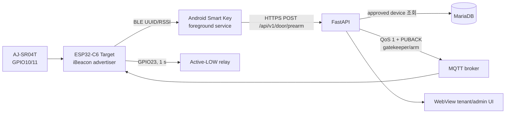
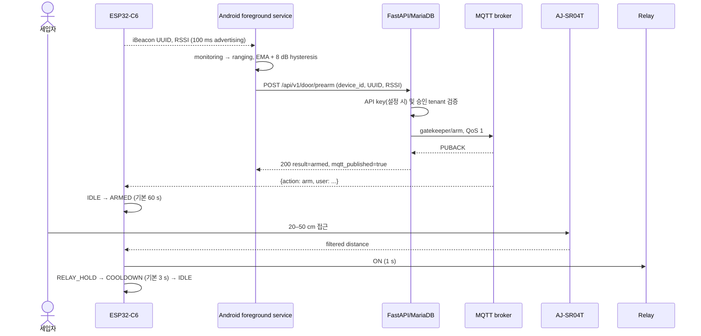

# architecture.md — 현재 시스템 아키텍처
> Last updated: 2026-07-30 (v2.1 current-code audit)

## 1. 범위

현재 시스템은 **외부 진입 전용**입니다. ESP32-C6 Target이 고정 iBeacon을 발신하고 Android 앱이 세입자 기기를 식별하여 Pre-arm을 요청합니다. 인증과 MQTT 전달이 완료된 뒤에만 Target이 초음파 접근을 문 열기 조건으로 사용합니다.



## 2. 정상 출입 시퀀스



서버는 사용자 검증이 성공해도 MQTT PUBACK을 받지 못하면 503을 반환합니다. 앱도 HTTP 200뿐 아니라 `result=armed`와 `mqtt_published=true`를 모두 요구합니다.

## 3. Target 펌웨어

### 3.1 상태 머신

```text
IDLE --MQTT arm--> ARMED --valid ultrasonic--> RELAY_HOLD --1 s--> COOLDOWN --configured delay--> IDLE
                         \--arm expiry-----------------------------------------------> IDLE
```

- ARMED: 기본 60초, NVS/MQTT/Web 설정 가능
- 거리: 5개 중앙값 필터, 20 cm 미만 무시, 기본 50 cm 임계값
- manual open: `gatekeeper/force_open` 또는 `smart-gatekeeper/cmd`가 거리/arm을 우회
- telemetry: `smart-gatekeeper/status`, event/config/sensor-info 토픽
- HA discovery: 부팅 후 MQTT 연결 때 22개 entity retained config 발행
- OTA: NAS의 `version.json`과 firmware binary 사용, 16 MB dual-OTA partition

### 3.2 네트워크와 설정

Wi-Fi 연결 실패 시 `SmartGatekeeper-Setup` AP/WebServer로 자격 증명과 Target tuning 값을 NVS에 저장합니다. 연결 상태에서는 15초 간격 watchdog이 `WiFi.reconnect()`를 호출합니다. MQTT는 Root CA로 TLS 연결을 시작하지만 3회 실패 후 `setInsecure()`로 전환하는 현재 동작은 보안 부채입니다.

### 3.3 BLE

코드는 Arduino-ESP32 `BLEDevice` API를 사용하지만 UUID native field는 NimBLE 계열 형태를 참조하고 주석은 Bluedroid라고 명시하여 스택 정체가 불일치합니다. iBeacon manufacturer payload의 UUID byte order는 코드만으로 합격 판정하지 않으며 실측이 필요합니다.

## 4. Android 앱

- foreground-service isolate가 유일한 native scanner owner입니다.
- IDLE은 region monitoring, INSIDE는 별도 identifier의 ranging stream을 사용합니다.
- 1100 ms scan / 0 ms between-scan, background mode, 6초 no-ranging 감지, 10초 restart throttle, 30초 watchdog을 적용합니다.
- RSSI는 EMA α=0.3, 기본 threshold -85 dBm, 이탈 hysteresis 8 dB입니다.
- 필수 권한/위치/Bluetooth/알림/배터리 최적화 상태를 확인하고 서비스 상태를 UI로 동기화합니다.
- force-stop, Android Active Apps의 Stop, 일부 OEM 강제 종료 뒤에는 자동 접근을 보장할 수 없습니다.

자세한 생애주기는 `mobile_app_scan_lifecycle.md`, 최신 수정 감사와 실기기 항목은 `mobile_app_background_audit.md`를 참조합니다.

## 5. Backend

FastAPI는 MariaDB의 tenant/device 승인을 확인하고 Paho MQTT를 통해 arm/force-open/config 명령을 보냅니다. MQTT Pre-arm은 loop 시작, QoS 1 publish, PUBACK 대기 후에만 성공입니다. 앱 remote config로 beacon UUID, cooldown, RSSI threshold를 제공합니다. 관리자 API와 `/admin` UI 자체 인증은 아직 코드에 없으므로 reverse proxy 접근 제한 또는 애플리케이션 인증이 필요합니다.

## 6. 실패 안전 경계

| 실패 | 기대 동작 |
|---|---|
| 미승인 device | 403, MQTT arm 없음, 문 닫힘 |
| API key 불일치 | 401, 앱 업데이트 안내, 문 닫힘 |
| MQTT publish/PUBACK 실패 | 503, 앱 짧은 재시도, 문 닫힘 |
| arm 뒤 접근 없음 | 유효시간 만료 후 IDLE |
| 센서 invalid/timeout/<20 cm | 릴레이 동작 없음 |
| force-open MQTT 권한 탈취 | 센서/tenant 검증 우회 가능 — broker ACL 필수 |
| Target TLS 검증 3회 실패 | 현재 insecure fallback — 암호화는 남지만 서버 인증 상실 |

## 7. 현 단계

기능 구현은 Target, backend, Android, CI/CD까지 통합되어 **프로덕션 검증 단계**입니다. 완료 조건은 최신 firmware/app 조합의 실기기 E2E, iBeacon raw payload, 24시간 RF soak, 릴레이 전기 안전, Android OEM별 백그라운드 검증입니다. PCB/하우징 양산과 관리자 인증은 미완료입니다.
