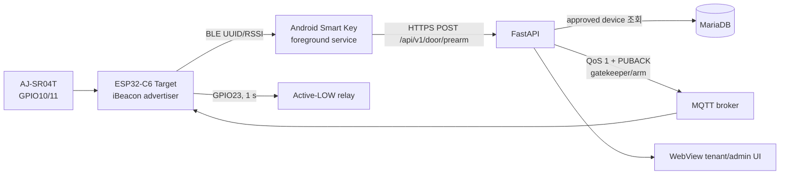
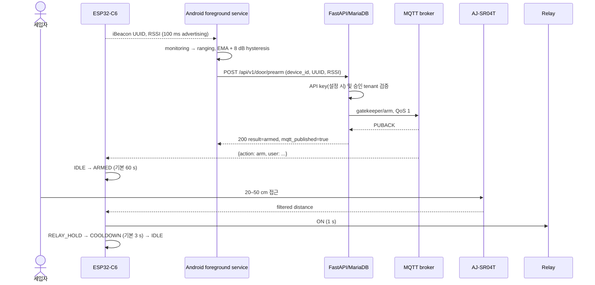

# architecture.md — 현재 시스템 아키텍처
> Last updated: 2026-07-31 (v2.1 remote reset diagnostics, UDP panic mitigation, relay fail-safe)

## 1. 범위

현재 시스템은 **외부 진입 전용**입니다. ESP32-C6 Target이 고정 iBeacon을 발신하고 Android 앱이 세입자 기기를 식별하여 Pre-arm을 요청합니다. 인증과 MQTT 전달이 완료된 뒤에만 Target이 초음파 접근을 문 열기 조건으로 사용합니다.



## 2. 정상 출입 시퀀스



서버는 사용자 검증이 성공해도 MQTT PUBACK을 받지 못하면 503을 반환합니다. 앱도 HTTP 200뿐 아니라 `result=armed`와 `mqtt_published=true`를 모두 요구합니다.

## 3. Target 펌웨어

### 3.1 상태 머신

```text
IDLE --MQTT arm--> ARMED --valid ultrasonic--> RELAY_HOLD --1 s--> COOLDOWN --configured delay--> IDLE
                         \--arm expiry-----------------------------------------------> IDLE
```

- ARMED: 기본 60초, NVS/MQTT/Web 설정 가능
- 거리: 5개 중앙값 필터, 20 cm 미만 무시, 기본 50 cm 임계값
- manual open: `gatekeeper/force_open` 또는 `smart-gatekeeper/cmd`가 거리/arm을 우회
- AJ-SR04T는 IDLE에서 상시 trigger하지 않고 ARMED 동안만 측정
- relay ON과 동시에 별도 `esp_timer` 1초 one-shot을 시작하므로 main loop block이나 state overwrite가
  생겨도 timer task가 물리 출력을 OFF
- relay ON/hold 중 새 arm은 안전 인터록으로 거부하고 manual open은 기존 arm을 취소
- telemetry: `smart-gatekeeper/status`, event/config/sensor-info 토픽
- retained diagnostics: `smart-gatekeeper/boot`와 `smart-gatekeeper/availability`
  - target/boot ID, boot count, reset reason, planned restart, 이전 RTC breadcrumb
  - relay command/GPIO, heap/stack, BSSID/channel, MQTT reconnect
  - flash coredump panic reason/task/PC/RISC-V cause/ELF SHA
- HA discovery: 부팅 후 MQTT 연결 때 22개 entity retained config 발행
- OTA: NAS의 `version.json`과 firmware binary 사용, 16 MB dual-OTA partition
- 모바일 앱·Target OTA는 출입 기능보다 우선하는 P0 불변조건이다. 새 local BLE 인증
  구조도 update control plane을 scanner/FSM/MQTT 단일 경로와 독립시키고, dual-slot
  health/rollback과 mobile/Target N/N-1 호환을 유지해야 한다. 상세 계약은
  [ota_reliability_contract.md](ota_reliability_contract.md)를 따른다.

#### MQTT 토픽 자동 등록 범위 감사 (2026-07-31)

MQTT 브로커에는 토픽을 사전 "등록"하는 절차가 없습니다. 이 펌웨어에서 자동화되는 것은
브로커 연결/재연결 직후의 **명령 토픽 subscribe**와 Home Assistant discovery config의
**retained publish**입니다.

| 구분 | 현재 자동 처리 | 판정 |
|------|----------------|------|
| 명령 수신 | `gatekeeper/arm`, `gatekeeper/force_open`, `smart-gatekeeper/cmd`, 개별 config 4개, `gatekeeper/config/set`, `gatekeeper/config/get`을 연결 성공 때마다 subscribe | 의도된 10개 토픽은 모두 자동 구독 요청됨 |
| HA entity | button 3 + status sensor 9 + binary sensor 2 + config number 4 + config state sensor 4 | 22개 discovery config를 연결 성공 때마다 retained 발행 |
| 상태 데이터 | availability, boot, config state는 retained 발행; status, event, ultrasonic raw sensor는 실행 중 발행 | MQTT publish는 자동이나 각각이 별도 HA entity로 모두 등록되는 것은 아님 |
| discovery 범위 밖 | boot/coredump 상세, availability 자체, event, ultrasonic `duration_us`, v2.1 추가 status 진단 필드 | 이들은 22개 entity와 별개의 원시 토픽/필드이며, HA entity로 만들기로 정의한 항목이 아님 |
| 전달 보장 | subscribe/publish 반환값은 일부 로그만 남기며 실패 항목 재시도·전체 성공 집계가 없음 | 연결 성공만으로 10개 구독/22개 discovery의 broker 수락을 보장하지 못함 |

따라서 펌웨어가 정의한 **22개 HA entity의 자동 discovery는 구현되어 있습니다.** 다만
"펌웨어가 사용하는 모든 원시 토픽/필드까지 HA entity로 변환"하거나 "22건의 broker 수락을 보장"하는
구현은 아닙니다.
완전 보장이 필요하면 각 subscribe/publish 결과를 검사하고 실패 목록만 재시도하며, boot/event/raw
ultrasonic 및 추가 진단 필드 중 HA에 노출할 항목을 명시적으로 discovery entity로 추가해야 합니다.

##### 기기 정보의 entity 수와 영역 화면 표시 수가 다른 이유

Home Assistant의 **기기 정보**는 discovery로 생성된 entity 전체를 보여주지만, 자동 생성되는 **영역
대시보드**는 그 전체 목록을 그대로 렌더링하지 않습니다. 영역 전략은 `entity_category`가 없는
primary entity만 선별하고, 화면별로 지원하는 domain/device class만 카드 또는 요약에 포함합니다.
이는 등록 실패가 아니라 Home Assistant UI의 의도된 필터링입니다.

현재 22개 중 Wi-Fi RSSI, free heap, uptime, firmware와 설정 상태 센서 4개, 합계 **8개**가
`entity_category: diagnostic`입니다. 이들은 기기 정보의 진단 섹션에는 존재하지만 영역 자동
대시보드에서는 제외됩니다. 나머지 entity도 sensor/button/number/binary_sensor domain별 영역 카드
지원 방식에 따라 요약되므로, 현장에서 약 11개만 보이는 현상은 22개 discovery 누락의 증거가
아닙니다.

모든 22개를 한 화면에 표시하려면 firmware의 진단 분류를 제거하지 말고 Home Assistant에서
수동 대시보드의 Entities 카드를 만들어 해당 entity를 명시적으로 추가해야 합니다. 진단 분류를
제거하면 영역 자동 화면에 일부가 더 노출될 수 있지만 RSSI/heap/firmware/저장 설정값을 primary
entity로 오분류하고 기본 UI를 혼잡하게 하므로 적용하지 않습니다.

근거: [Home Assistant entity registry properties](https://developers.home-assistant.io/docs/core/entity/#registry-properties),
[Areas dashboard entity filters](https://github.com/home-assistant/frontend/blob/b1ccb6355d9671532d00369918f678fcc8cb1d28/src/panels/lovelace/strategies/areas/helpers/areas-strategy-helper.ts).

### 3.2 네트워크와 설정

Wi-Fi 연결 실패 시 `SmartGatekeeper-Setup` AP/WebServer로 자격 증명과 Target tuning 값을 NVS에 저장합니다.
과거 coredump에서 `udp_new_ip_type` core-lock assertion이 확인돼 captive DNS와 기능상 불필요한
SNTP 초기화를 제거했습니다. AP 설정 화면은 `http://192.168.4.1`로 직접 엽니다.
정상 연결은 pure `WIFI_STA`로 전환하고 SoftAP를 종료하며, credential `/save`는 provisioning AP mode에서만
허용합니다. 연결 상태에서는 15초 간격 watchdog이 `WiFi.reconnect()`를 호출합니다. MQTT는 Root CA로
TLS 연결을 시작하지만 3회 실패 후 `setInsecure()`로 전환하는 현재 동작은 보안 부채입니다.

### 3.3 BLE

코드는 Arduino-ESP32 `BLEDevice` API를 사용하지만 UUID native field는 NimBLE 계열 형태를 참조하고 주석은 Bluedroid라고 명시하여 스택 정체가 불일치합니다. iBeacon manufacturer payload의 UUID byte order는 코드만으로 합격 판정하지 않으며 실측이 필요합니다.

향후 connectable GATT local auth의 Android Keystore P-256 자격, MTU 독립 framing,
canonical challenge/proof, signed ACL lease와 N/N-1 보안 계약은
[security_protocol.md](security_protocol.md)를 따른다. 현재 iBeacon/MQTT 경로가 해당 계약을
이미 구현했다는 뜻은 아니며 Wave 1 구현 전제 규격이다.

## 4. Android 앱

- foreground-service isolate가 유일한 native scanner owner입니다.
- IDLE은 region monitoring, INSIDE는 별도 identifier의 ranging stream을 사용합니다.
- 1100 ms scan / 0 ms between-scan, background mode, 6초 no-ranging 감지, 10초 restart throttle, 30초 watchdog을 적용합니다.
- RSSI는 EMA α=0.3, 기본 threshold -85 dBm, 이탈 hysteresis 8 dB입니다.
- 필수 권한/위치/Bluetooth/알림/배터리 최적화 상태를 확인하고 서비스 상태를 UI로 동기화합니다.
- force-stop, Android Active Apps의 Stop, 일부 OEM 강제 종료 뒤에는 자동 접근을 보장할 수 없습니다.

자세한 생애주기는 `mobile_app_scan_lifecycle.md`, 최신 수정 감사와 실기기 항목은 `mobile_app_background_audit.md`를 참조합니다.

## 5. Backend

FastAPI는 MariaDB의 tenant/device 승인을 확인하고 Paho MQTT를 통해 arm/force-open/config 명령을 보냅니다. MQTT Pre-arm은 loop 시작, QoS 1 publish, PUBACK 대기 후에만 성공입니다. 앱 remote config로 beacon UUID, cooldown, RSSI threshold를 제공합니다. 관리자 API와 `/admin` UI 자체 인증은 아직 코드에 없으므로 reverse proxy 접근 제한 또는 애플리케이션 인증이 필요합니다.

## 6. 실패 안전 경계

| 실패 | 기대 동작 |
|---|---|
| 미승인 device | 403, MQTT arm 없음, 문 닫힘 |
| API key 불일치 | 401, 앱 업데이트 안내, 문 닫힘 |
| MQTT publish/PUBACK 실패 | 503, 앱 짧은 재시도, 문 닫힘 |
| arm 뒤 접근 없음 | 유효시간 만료 후 IDLE |
| 센서 invalid/timeout/<20 cm | 릴레이 동작 없음 |
| force-open MQTT 권한 탈취 | 센서/tenant 검증 우회 가능 — broker ACL 필수 |
| Target TLS 검증 3회 실패 | 현재 insecure fallback — 암호화는 남지만 서버 인증 상실 |

## 7. 현 단계

기능 구현은 Target, backend, Android, CI/CD까지 통합되어 **프로덕션 검증 단계**입니다. 완료 조건은 최신 firmware/app 조합의 실기기 E2E, iBeacon raw payload, 24시간 RF soak, 릴레이 전기 안전, Android OEM별 백그라운드 검증입니다. PCB/하우징 양산과 관리자 인증은 미완료입니다.
