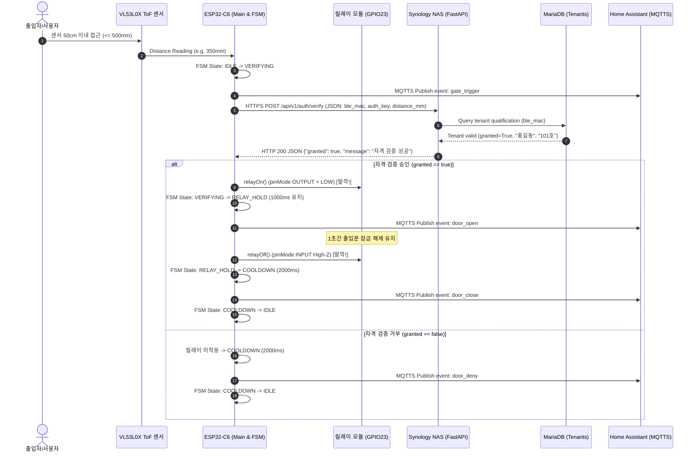
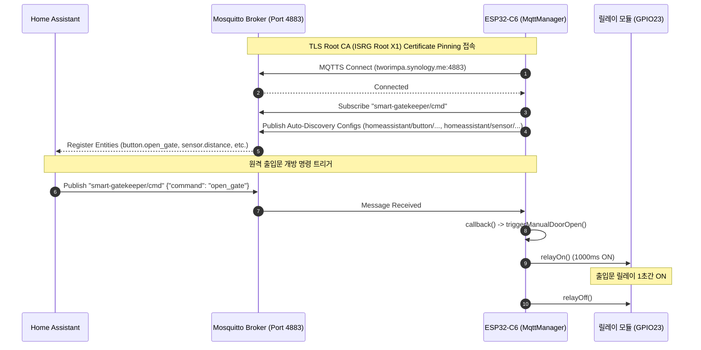
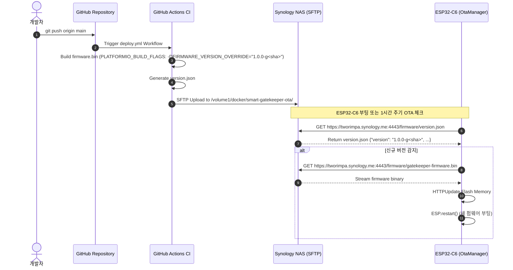

# architecture.md — 시스템 아키텍처 및 로드맵
> Last updated: 2026-07-24 (Step 3 & OTA/MQTTS 통합 완료)

---

## 1. 시스템 아키텍처 개요

`smart-gatekeeper`는 ESP32-C6 (RISC-V) 기반 출입 통제 컨트롤러로, ToF 레이저 센서 감지 ➔ 시놀로지 NAS HTTPS 자격 검증 API ➔ 1채널 릴레이 스위칭 ➔ MQTTS (TLS 4883) Home Assistant 자동 검색 & 텔레메트리 ➔ GitHub CI/CD SFTP OTA 파이프라인으로 구성되어 있습니다.

```
┌────────────────────────────────────────────────────────────────────────────────────────┐
│                                   smart-gatekeeper                                     │
│                                                                                        │
│  [VL53L0X ToF (GPIO6/7)] ───► [ESP32-C6 Controller] ───► [Relay (GPIO23)] ──► [도어락] │
│                                       │                                                │
│                 ┌─────────────────────┼─────────────────────┐                          │
│                 ▼                     ▼                     ▼                          │
│       [WiFi CaptivePortal]    [HTTPS API Client]     [MQTTS HA Discovery]              │
│       (SmartGatekeeper-Setup)  (tworimpa:4442)         (tworimpa:4883)                 │
│                                       │                     │                          │
│                                       ▼                     ▼                          │
│                                [FastAPI + MariaDB]   [Home Assistant]                  │
│                                (Synology NAS)        (Auto-Discovery)                  │
└────────────────────────────────────────────────────────────────────────────────────────┘
```

---

## 2. 전체 통합 시퀀스 다이어그램 (Sequence Diagram)

### 2.1. E2E 출입 감지 & 자격 검증 시퀀스



### 2.2. MQTTS HA Auto-Discovery & 원격 개방 시퀀스



### 2.3. GitHub CI/CD & 무선 OTA 배포 시퀀스



---

## 3. 단계별 로드맵 및 상태

| 단계 | 이름 | 목표 | 상태 |
|------|------|------|------|
| **Step 1** | Local PoC | ToF + Relay 단독 및 로컬 연동 검증 | 🟢 **완료** (2026-07-24) |
| **Step 2** | 백엔드 구축 | 시놀로지 NAS FastAPI + MariaDB Docker 구축 & HTTPS API 검증 | 🟢 **완료** (2026-07-24) |
| **Step 3** | WiFi + NAS 연동 | ESP32-C6 WiFi/CaptivePortal + NAS HTTPS 자격검증 및 릴레이 연동 | 🟢 **완료** (2026-07-24) |
| **Step 4** | MQTTS & OTA | HA Auto-Discovery, MQTTS 4883 TLS Pinning, GitHub CI/CD SFTP OTA | 🟢 **완료** (2026-07-24) |
| **Step 5** | BLE / 방향 감지 | 스마트폰 BLE 키 인증 및 2채널 ToF IN/OUT 판별 | 🔲 미시작 |
| **Step 6** | 프로덕션 | PCB 설계, 케이스, 양산 가공 | 🔲 미시작 |

---

## 4. 소프트웨어 구조

```
smart-gatekeeper/
├── include/
│   ├── config.h          — 전역 핀 매핑 및 임계값 설정
│   ├── ConfigManager.h   — Preferences NVS 설정 관리
│   ├── MqttManager.h     — MQTTS TLS (4883) & HA Auto-Discovery
│   ├── OtaManager.h      — HTTPS OTA 무선 업데이트
│   ├── ToFSensor.h       — VL53L0X 드라이버 래퍼
│   ├── secrets.h         — 보안 자격 증명 (Git 제외)
│   └── secrets.h.example — 보안 템플릿
├── src/
│   ├── main.cpp          — 메인 루프 & FSM
│   ├── ConfigManager.cpp
│   ├── MqttManager.cpp
│   ├── OtaManager.cpp
│   ├── ToFSensor.cpp
│   └── WifiManager.cpp   — Captive Portal AP 설정
├── backend/
│   ├── app/main.py       — FastAPI REST API (/api/v1/auth/verify)
│   ├── docker-compose.yml
│   └── init.sql          — MariaDB DDL 스키마
└── .github/workflows/
    └── deploy.yml        — GitHub CI/CD 빌드 및 SFTP 자동 배포
```
