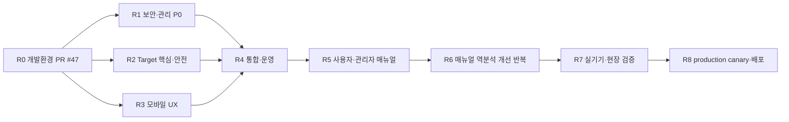

# commercial_release_program.md — 상용 출시 프로그램
> Program baseline: 2026-08-08
> Orca Run: `run_40f9831625bd`
> Production status: **BLOCKED / fail-closed**
>
> Status note (2026-08-12): 이 문서는 2026-08-08 출시 프로그램 snapshot이다. #49~#52의 관리자 인증, per-Target MQTTS/signed command/OTA, mobile recovery/update와 operations software gap은 이후 구현됐다. 아래 당시 P0 목록과 작업 배정은 역사적 계획으로 보존하며 현재 상태는 [project_status.md](project_status.md)와 [current_code_audit.md](current_code_audit.md)를 따른다. 상용 physical/operator/production Gate는 여전히 닫혀 있다.
>
> Status note (2026-08-30): #49/#55와 NAS adoption/deployment blockers are
> closed; the exact backend is deployed and one signed mobile/Target
> foreground/screen-off software loop is accepted. Epic #13 and issue #262 were
> closed during issue hygiene because their remaining work is already owned by
> #51/#54/#48. Current open release work is #48, #50~#54, #179 and truthful
> result bug #276. Sensor/relay/door, process-death/OEM repetition, soak,
> operator walkthrough and production canary remain release-blocking.

## 1. 최종 목표

Smart Gatekeeper를 핵심 출입 기능, ESP32-C6 Target, Backend/NAS, 관리자 시스템,
Android 모바일 앱, OTA/rollback, 관측성, 운영 절차, 일반 사용자·관리자 매뉴얼까지 포함한
상용 제품으로 완성하고 통제된 production canary를 거쳐 배포한다.

“문제가 없을 것”은 선언으로 승인하지 않는다. 아래의 자동화, 실기기, 운영자, production
증거가 모두 동일 release candidate에 결합되어야 출시 완료로 판정한다.

## 2. 현재 기준선

| 영역 | 현재 근거 | 판정 |
|---|---|---|
| 소프트웨어 기준선 | `b246aff`에서 root 87/87, backend/protocol/observability/OTA contract, ESP32-C6 build, Flutter 11/11 | host/software 검증 완료; 최종 후보 SHA에 재결합 필요 |
| Orca 개발환경 | setup/doctor/Quick/Software/Firmware/App 및 fresh-worktree smoke | PR #47 병합 및 post-merge CI 성공 (`b246aff`) |
| 관리자 시스템 | 2026-08-08 당시 인증/RBAC gap; 이후 session/CSRF/RBAC/re-auth software 구현 | software gap resolved; live ops evidence pending |
| Target 네트워크 보안 | 2026-08-08 당시 insecure fallback; 이후 per-Target MQTTS/signed command fail-closed 구현 | software gap resolved; deployed handshake pending |
| 모바일 사용성 | 2026-08-08 당시 native wake/GATT/updater gap; 이후 default-OFF worker와 recovery/update 구현 | software gap resolved; OEM/physical Gate pending |
| 물리 장비 | Samsung/OEM, ESP32-C6 BLE/Wi-Fi, GPIO23 relay, AJ-SR04T, bootloader/OTA 증거 없음 | `G0-HW PENDING` |
| Production | `release-evidence.json`이 release blocked를 유지 | `BLOCKED` |

## 3. 증거 등급과 출시 권한

| 등급 | 필수 증거 | 허용되는 결론 |
|---|---|---|
| L0 정적/로컬 | lint, unit, integration, build, fault injection | 소프트웨어 후보 가능 |
| L1 Hosted CI | exact SHA의 required checks, artifact digest/signature | 검토·병합 가능 |
| L2 물리 장비 | Samsung/ESP32-C6/relay/sensor/bootloader 원시 로그 | 실기기 Gate 판정 가능 |
| L3 운영자 | 설치·복구·매뉴얼 walkthrough, 승인자와 시간 기록 | canary 승인 가능 |
| L4 Production | 동일 artifact 설치→재부팅→health와 rollback drill | 배포 완료 판정 가능 |

L0/L1은 L2를 대체하지 않으며, `ready`, heartbeat, 빌드 성공, artifact upload 또는 MQTT
PUBACK만으로 물리/production 완료를 주장하지 않는다.

## 4. 작업 흐름과 의존성

서로 다른 구현 영역은 독립 Orca 작업트리에서 진행한다. 보안/안전 변경의 작성자와 검토자는
분리하고 exact-head CI와 미해결 review thread를 확인한 뒤에만 병합한다.

## 5. 출시 작업 패키지

### R0 — 재현 가능한 개발·검증 환경

- PR #47의 독립 검토, exact-head 보호 workflow, 병합과 post-merge CI를 `b246aff`에서 완료했다.
- setup, doctor, Quick, Software, Firmware, App suite를 모든 새 작업트리의 공통 입구로 사용한다.
- 완료 조건: PR 병합, post-merge main CI, fresh-worktree 재검증.

### R1 — 보안과 관리자 시스템 (software implemented; 운영 증거 pending)

- 모든 admin UI/API, 출입 로그, 원격 설정, 승인·회수·강제 개방을 인증 경계 안으로 이동한다.
- tenant 범위 RBAC, 짧은 세션, CSRF 방어, 재인증이 필요한 위험 동작, 감사 trail을 구현한다.
- 정적 shared key의 저장·회전·폐기·rate limit·lockout 정책을 확정한다.
- Target의 MQTT `setInsecure()` fallback을 제거하고 인증서/시간 오류에서 fail-closed 복구한다.
- 승인, 회수, tenant disable, ACL snapshot/ACK, OTA metadata의 원자성·복구성을 검증한다.
- 완료 조건: 우회 mutation test, 권한 매트릭스, 감사 불변성, backup/restore drill, 위협모델 검토.

### R2 — 핵심 Target 기능과 물리 안전 (software implemented; physical Gate pending)

- signed local GATT proof → ACL → access-session FSM → relay 인터록을 production 경로로 통합한다.
- stale/duplicate callback, disconnect, reset, queue overflow, Wi-Fi/BLE 공존을 fail-closed 시험한다.
- GPIO23 High-Z OFF, one-shot, AJ-SR04T 19/20 cm 경계, 전원·레벨 시프팅·flyback을 검증한다.
- OTA dual-slot, periodic HTTPS, 인증 local recovery, install→reboot→health→rollback을 구현·검증한다.
- 완료 조건: RELAY-G0~G2, OTA-G1~G4, 24시간 RF/네트워크 soak, power-loss matrix.

### R3 — 최상급 모바일 UX (software implemented; OEM/사용성 증거 pending)

- 첫 실행 onboarding을 권한·Bluetooth·위치·알림·배터리 예외의 단계별 진단으로 구성한다.
- 자동 출입, 수동 개방, 오프라인, 승인 대기, 차단, update/rollback 상태를 일반 용어로 표시한다.
- TalkBack, text scale 200%, 색 대비, 48dp touch target, 한국어/영어, 화면 회전·소형 화면을 지원한다.
- force-stop/OEM 제한을 숨기지 않고 Samsung 설정 이동과 수동 fallback을 한 화면에서 제공한다.
- update manager를 scanner/WebView/출입 FSM과 독립시키고 hash/certificate/fallback/복구 UX를 검증한다.
- 완료 조건: 핵심 여정 widget/integration test, 접근성 검사, Samsung 실기기 100회, 사용성 관찰.

### R4 — 통합, 관측성, 운영 준비

- access/update/reset/rollback event를 immutable artifact와 session/boot ID에 결합한다.
- SLO, alert, log retention/privacy, DB migration, backup/restore, capacity/rate limit을 운영화한다.
- NAS/MariaDB/MQTT 장애, 인증서 만료, 저장공간 부족, 네트워크 단절, 중복 명령을 주입한다.
- 완료 조건: 장애별 감지·중단·복구 시간, 데이터 무손실 기준, runbook walkthrough.

### R5/R6 — 매뉴얼 작성과 제품 역분석

일반 사용자 매뉴얼은 설치, 등록, 권한, 자동·수동 출입, 상태 이해, 배터리/OEM 설정,
업데이트, 장애 자가복구, 개인정보·지원 자료 수집을 포함한다. 관리자 매뉴얼은 배포,
tenant/device/door 수명주기, 승인·회수, 강제 개방 통제, 로그 조사, backup/restore,
인증서·키 회전, OTA canary/rollback, 사고 대응을 포함한다.

각 절차는 다음 역분석을 반복한다.

1. 매뉴얼만 받은 신규 사용자가 목표를 달성할 수 있는지 수행한다.
2. 앱/관리 화면에서 매뉴얼 설명이 필요한 지점을 제품 결함 후보로 등록한다.
3. 모호한 상태, 과도한 단계, 숨은 전제, 복구 불가능 지점을 제품에서 먼저 개선한다.
4. 자동·실기기 regression을 추가하고 매뉴얼을 다시 작성한다.
5. 일반 사용자와 관리자가 독립 walkthrough를 통과할 때까지 반복한다.

### R7/R8 — 실기기 승인과 production 배포

- 동일 release candidate로 Samsung/OEM, ESP32-C6, 실제 relay/sensor, bootloader/OTA 시험을 수행한다.
- 사용자·관리자 매뉴얼 walkthrough와 장애 복구 drill을 운영자가 서명한다.
- signed artifact와 evidence bundle을 production Gate에 입력하고 소수 canary에만 먼저 배포한다.
- canary install→reboot→health, 출입 SLO, rollback 가능성을 확인한 뒤 점진 확대한다.
- 중단 기준 위반 시 즉시 rollout을 중단하고 기존 정상 firmware/APK로 복구한다.

## 6. 상용 출시 Definition of Done

- P0/P1 보안·안전·데이터 무결성 이슈가 0개다.
- exact release SHA와 artifact digest/signature가 local, CI, physical, production 증거에 동일하다.
- 정상·실패·복구·N/N-1·전원 차단 시험이 모두 통과한다.
- 일반 사용자와 관리자가 매뉴얼만으로 핵심 여정과 복구를 수행한다.
- Samsung/OEM, ESP32-C6, relay/sensor, OTA/rollback 실기기 Gate가 원시 증거와 함께 승인된다.
- production canary의 install/reboot/health와 rollback drill이 승인된다.
- 미완료 Gate, 가정, 알려진 제한이 없다. 남아 있다면 출시 완료가 아니라 release blocked다.

## 7. 감사 결과와 GitHub 출시 백로그 (2026-08-08 historical snapshot)

세 독립 감사가 exact local HEAD `dd8996c110fae1b378e31c3b1f8be8db7b84307d`에서
읽기 전용으로 완료됐다. 공통 P0는 다음과 같다.

- 인증 없는 legacy admin/tenant/config/log 경로와 spoofable `device_id` force-open 권한
- Backend 평문/CERT_NONE 및 Target `setInsecure()` MQTT, unsigned/replayable actuator 명령
- Target/mobile runtime signed OTA, periodic/local recovery, install/boot health rollback 부재
- production hardwareless compile-on/stale NVS와 secure-boot/encrypted-storage/manufacturing hardening 부재
- mobile fresh-install wake 등록 미도달, `TARGET_LOCAL` 수동 GATT 실패, 복구 UI lockout
- mobile unsigned updater, APK hash/certificate/health 부재, release debug-signing fallback
- 물리 Samsung/ESP32-C6/relay/sensor/RELAY/OTA/operator/production 증거 부재

| Issue | 작업 패키지 | 출시 관계 |
|---|---|---|
| #48 | 상용 출시 및 production 배포 Epic | 최종 Gate |
| #49 | 관리자 인증/RBAC와 legacy control-plane fail-closed | P0 |
| #50 | Target signed command/TLS/OTA/rollback/device hardening | P0 |
| #51 | mobile native wake/GATT/recovery/signed updater/상용 UX | P0 |
| #52 | observability/privacy/supply-chain/SLO/backup | P1 |
| #53 | 일반 사용자·관리자·설치자 매뉴얼과 역분석 반복 | P1 |
| #54 | 실기기 acceptance, operator drill, production canary | G0-HW/Release |
| #55 | Orca 후속 supervised worker-start 초기화 장애 | 개발환경 P0 |

## 8. 당시 작업 배정

| Orca task | 담당 profile | 범위 | 상태 |
|---|---|---|---|
| `task_a68b0e6f63bd` | gpt-5.6-sol | 아키텍처·보안·release 감사 | 완료 |
| `task_9a34df6a2c24` | gpt-5.6-terra | firmware/backend/admin/운영 감사 | 완료 |
| `task_7edd390041a9` | gpt-5.6-luna | 모바일 UX·접근성·매뉴얼 감사 | 완료 |
| `task_a513d06b69d8` | gpt-5.6-terra | PR #47 exact-head review | MCP startup 중단 2회, blocked |
| `task_c0d82ac39236` | gpt-5.6-luna | PR #47 review 재배정 | 동일 장애, blocked |
| `task_6c49499b49d3` | coordinator | PR #47 통합·post-merge 검증 | 완료 (`b246aff`) |
| `task_23fe4956824c` | gpt-5.6-terra | #49 관리자 보안 | 수행 중, Draft PR #57 리뷰 대기 |
| `task_e5534f8933b7` | gpt-5.6-sol | #50 Target 신뢰·OTA | 수행 중 |
| `task_fa76e808dd90` | gpt-5.6-luna | #51 모바일 상용 UX | 수행 중 |
| `task_aab3267285d3` | gpt-5.6-terra | #52 production 운영 | #49~#51 통합 전 pending |
| `task_524af7bf8a7c` | gpt-5.6-luna | #53 매뉴얼 기준선 | Draft PR #58 리뷰 대기 |
| `task_485b86acea1e` | gpt-5.6-sol | #54 물리 Gate 준비 | 준비 범위 수행 중; 실측 pending |
| `task_294d51f66668` | gpt-5.6-sol | #55 Orca 장기 수명주기 | 수행 중 |

PR #47은 독립 검토와 보완을 거쳐 `b246aff9698ccbcbcd864f99aab63654cce2cc78`로 병합됐고
GitHub Actions run `31268170523` 및 fresh Quick 검증이 성공했다. 이 결과는 host/software 범위이며
#55 장기 완료 신호, Samsung/OEM, ESP32-C6, relay/sensor, bootloader, OTA, 운영자와 production Gate를 닫지 않는다.

구현 작업은 읽기 전용 감사와 분리하고, 각 worker의 `worker_done`, exact commit, 검증 결과,
blocker를 확인해 다음 단계로 넘긴다.
