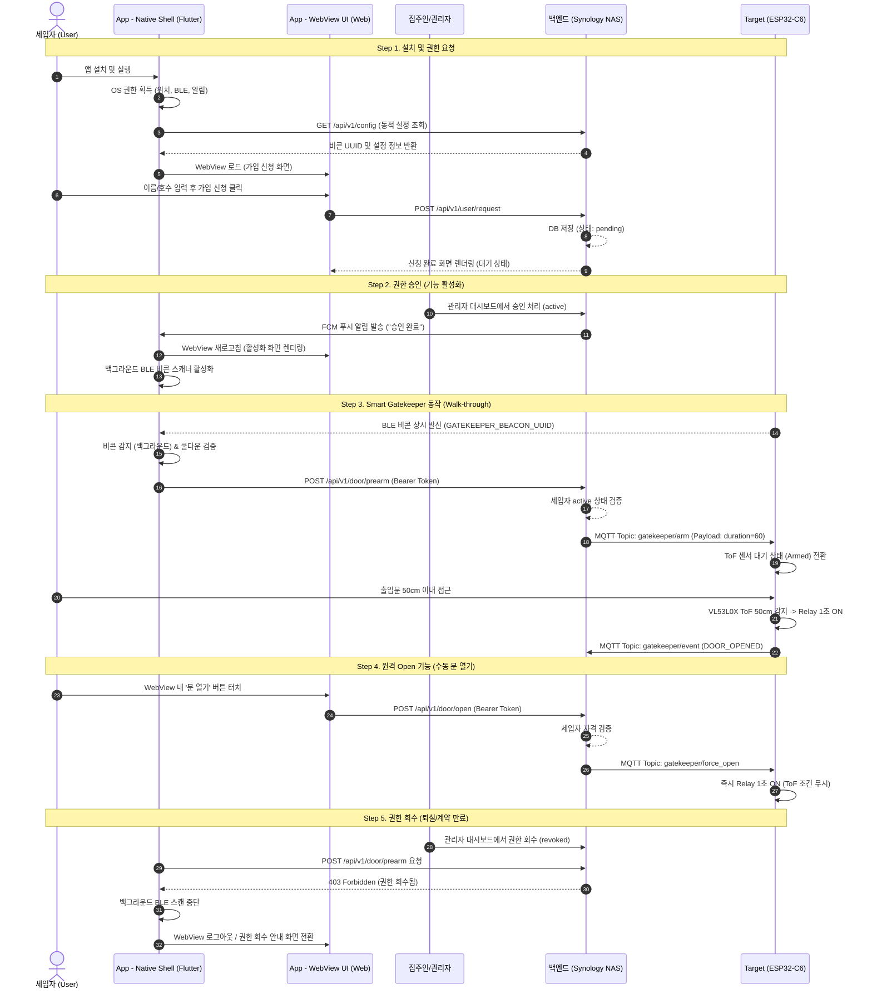

# wiki/mobile_app_scenario.md — 모바일 어플리케이션(Smart Key) 시나리오 기획서
> **Step 6: 세입자용 모바일 어플리케이션 개발 기획서**  
> Last updated: 2026-07-25  
> Architecture Model: **Entry-Only (외부 진입 전용)**, **Role Reversal (Target BLE Beacon 상시 발신)** & **Flutter 하이브리드 Zero-Update 전략**

---

## 1. 시스템 개요 및 하이브리드 아키텍처 요약

본 기획서는 `smart-gatekeeper` 시스템의 **6단계: 세입자용 모바일 어플리케이션(Smart Key)** 개발을 위한 전체 동작 시나리오 및 기술 사양을 정의합니다.

### 1.1 하드웨어 아키텍처 (Role Reversal & Entry-Only)
기존 BLE 기반 출입 시스템의 단점(스마트폰이 항상 BLE 패킷을 광고하여 심각한 배터리 소모 발생, OS 단의 백그라운드 BLE 광고 제약)을 극복하기 위해 **역발상 아키텍처**를 적용합니다.

1. **Target 비콘 상시 발신 (Role Reversal)**:
   - 스마트폰 대신 현관에 설치된 **ESP32-C6 (Target)**가 고유 비콘(`GATEKEEPER_BEACON_UUID`)을 24시간 상시 브로드캐스팅(반경 10~15m)합니다.
   - 스마트폰 모바일 앱은 백그라운드에서 특정 UUID 비콘만 저전력으로 감지(Region Monitoring / Scanning)합니다.
2. **배터리 효율 및 보안 극대화**:
   - 모바일 앱은 ESP32-C6와 직접 BLE 연결을 맺지 않고, 비콘 감지 시 **백엔드(Synology NAS) REST API**로 Pre-arming(사전 승인)을 요청합니다.
   - 백엔드는 사용자 권한을 검증 후 **MQTTS 보안 암호화 채널**을 통해 ESP32-C6로 제어 명령을 하달하므로 BLE 스푸핑 및 재생(Replay) 공격을 완벽히 차단합니다.
3. **외부 진입 전용 (Entry-Only Walk-through)**:
   - 비콘 수신 및 사전 승인(Pre-arming)이 완료된 상태에서 세입자가 ToF 센서 50cm 이내로 접근할 때만 릴레이가 작동하여 문이 열립니다.

### 1.2 소프트웨어 아키텍처 (Flutter Hybrid Zero-Update 전략)
앱 스토어(App Store / Play Store) 심사 지연 및 세입자 앱 업데이트 번거로움을 최소화하기 위해 **Flutter 기반의 하이브리드(Thin Client + WebView)** 아키텍처로 설계합니다.

* **Native Shell (Flutter Engine)**: 화면에 보이지 않는 백그라운드 코어로, BLE 비콘 스캐닝, OS 권한 관리, FCM 푸시 알림 수신, 백엔드 Pre-arm API 호출 및 동적 설정(`/config`) 동기화 담당.
* **WebView UI (Hosted on Synology NAS)**: 눈에 보이는 UI 전체. 시놀로지 NAS 웹 서버에서 렌더링되며, UI 변경 시 앱 업데이트 없이 백엔드 웹 소스 변경만으로 즉시 전 세입자 앱에 반영 (Zero-Update 전략).

```
┌─────────────────────────────────────────────────────────────────────────────────────────┐
│                              System Interaction Overview                                │
│                                                                                         │
│  [Target: ESP32-C6]                                                                     │
│     │  ▲ (1) BLE Beacon Broadcast (GATEKEEPER_BEACON_UUID: 10~15m)                      │
│     │  │                                                                                │
│     │  └──────────────┐                                                                 │
│     │                 ▼                                                                 │
│     │          ┌─────────────────────────────────────────────────────────────┐          │
│     │          │ [App: Smart Key (Flutter Hybrid)]                           │          │
│     │          │  ├── Native Shell: Background Scanning Engine & FCM         │          │
│     │          │  └── WebView UI   : Hosted Frontend from Synology NAS       │          │
│     │          └──────────────────────────────┬──────────────────────────────┘          │
│     │                                         │                                         │
│     │                                         │ (2) Pre-arm REST API (Bearer Token)     │
│     │                                         ▼                                         │
│     │                                [Backend: Synology NAS]                            │
│     │                                  • Auth Verification (Status: Active)             │
│     │                                  • Serves WebView UI Frontend                     │
│     │  (3) MQTTS                              │                                         │
│     └───────── Topic: gatekeeper/arm ─────────┘                                         │
│                                                                                         │
│  [Target: ESP32-C6] ──ToF 50cm Detection──► Relay 1s Trigger (Door Open!)               │
└─────────────────────────────────────────────────────────────────────────────────────────┘
```

---

## 2. 컴포넌트별 주요 역할

| 컴포넌트 | 구분 / 모듈 | 주요 역할 및 핵심 기능 |
|:---|:---|:---|
| **App** | **Native Shell**<br>*(Flutter Engine)* | • **보이지 않는 엔진 역할**<br>• OS 필수 권한(위치, 블루투스, 푸시 알림, 백그라운드) 획득 및 관리<br>• 백엔드 동적 설정 API (`GET /api/v1/config`) 호출 ➔ Target 비콘 UUID, 스캔 주기 등 동적 로드 (Remote Config)<br>• 백그라운드 BLE 비콘 스캐닝 및 감지 시 Pre-arm API (`POST /api/v1/door/prearm`) 호출<br>• 연속 비콘 수신 시 중복 API 요청 방지를 위한 **쿨다운(Cooldown, 30초) 타이머 제어**<br>• FCM/APNs 푸시 알림 수신 및 알림 클릭 시 WebView 페이지 전환 핸들링 |
| | **WebView UI**<br>*(NAS Hosted Web)* | • **눈에 보이는 UI 전체 (HTML/JS/CSS)**<br>• 세입자 회원가입 폼, 동/호수 입력 UI 렌더링<br>• 사용자 승인 상태 (`pending`, `active`, `revoked`) 안내 화면 표시<br>• 앱 내 수동 **'문 열기(Force Open)'** 원격 개방 버튼 UI 제공<br>• 출입 기록 및 사용자 프로필 관리 화면 제공 |
| **Backend** | **Synology NAS**<br>*(FastAPI + MariaDB)* | • WebView 웹 프론트엔드 호스팅 (Nginx / FastAPI Static)<br>• 세입자 계정 및 권한 상태 관리 (`pending`, `active`, `revoked`)<br>• 동적 설정 API (`GET /api/v1/config`) 제공<br>• 모바일 앱 API 요청 인증/인가 검증 (JWT Token & Device Identifier)<br>• 검증 성공 시 MQTTS 브로커를 통해 Target으로 제어 명령(`gatekeeper/arm`, `gatekeeper/force_open`) 발행<br>• 출입 이력 및 모니터링 로그 DB 저장 |
| **Target** | **ESP32-C6 Gatekeeper** | • `GATEKEEPER_BEACON_UUID` 상시 비콘 브로드캐스팅 (외부 10~15m 반경)<br>• MQTTS 암호화 채널 수신 대기<br>• `gatekeeper/arm` 수신 시 ToF 센서 60초간 대기(Armed) 상태로 전환<br>• Armed 상태에서 ToF 50cm 이내 물리적 접근 감지 시 릴레이(GPIO 23) 1초 개방 후 COOLDOWN 전환<br>• `gatekeeper/force_open` 수신 시 ToF 감지 조건 없이 즉시 릴레이 1초 개방 |

---

## 3. 5단계 핵심 사용 시나리오



### 상세 흐름 설명

#### **Step 1. 설치 및 권한 요청 (Installation & Sign-up)**
1. 세입자가 App Store / Play Store에서 **Smart Key** (Flutter기반) 앱을 설치합니다.
2. 앱 실행 시 Native Shell이 OS 필수 권한(위치, 블루투스, 푸시 알림, 백그라운드 실행)을 요청하고 획득합니다.
3. Native Shell이 백엔드 동적 설정 API(`GET /api/v1/config`)를 호출하여 감지 대상 `GATEKEEPER_BEACON_UUID` 및 스캔 설정을 수신합니다.
4. WebView UI가 NAS 웹 서버로부터 가입 신청 화면을 렌더링하고, 세입자가 이름, 동/호수 정보를 입력 후 신청합니다.
5. REST API(`POST /api/v1/user/request`)를 통해 백엔드 DB에 `pending`(승인 대기) 상태로 저장됩니다.

#### **Step 2. 권한 승인 (Feature Activation)**
1. 건물 관리자(집주인)가 백엔드 대시보드에서 세입자를 **'승인(Active)'** 처리합니다.
2. 백엔드가 Native Shell로 FCM/APNs 푸시 알림을 발송합니다.
3. 푸시 알림 수신 및 앱 실행 시 WebView UI가 '승인 완료/활성화' 화면을 렌더링합니다.
4. Native Shell은 백그라운드 BLE 비콘 스캐너 서비스를 즉시 작동시킵니다.

#### **Step 3. Smart Gatekeeper 동작 (Walk-through Automatic Entry)**
1. 현관의 **ESP32-C6 (Target)**는 `GATEKEEPER_BEACON_UUID` 비콘을 상시 브로드캐스팅(외부 10~15m)합니다.
2. 세입자가 접근하여 Native Shell이 백그라운드에서 비콘을 감지합니다.
3. Native Shell은 쿨다운 타이머(30초 내 재발송 금지)를 확인 후 백엔드 Pre-arm API(`POST /api/v1/door/prearm`)를 호출합니다.
4. 백엔드는 토큰 및 계정 상태(`active`) 검증 후 MQTT `gatekeeper/arm` 메시지를 Target으로 하달합니다.
5. Target은 ToF 센서를 대기(Armed, 60초) 상태로 전환합니다.
6. 세입자가 50cm 이내로 접근하면 ToF 센서가 감지하고 릴레이를 1초간 작동시켜 도어락을 개방합니다.

#### **Step 4. 원격 Open 기능 (Manual Remote Open)**
1. 세입자가 WebView 화면 중앙의 **'문 열기(Force Open)'** 버튼을 수동으로 터치합니다.
2. WebView가 백엔드 원격 개방 API(`POST /api/v1/door/open`)를 호출합니다.
3. 백엔드는 검증 후 MQTT `gatekeeper/force_open` 메시지를 Target으로 발행합니다.
4. Target은 ToF 거리 조건 없이 즉시 릴레이를 1초간 작동시켜 문을 열어줍니다.

#### **Step 5. 권한 회수 (Auth Revocation & Security Enforcement)**
1. 계약 만료/퇴실 시 관리자가 세입자 상태를 `revoked`(권한 회수)로 변경합니다.
2. Native Shell이 비콘 감지 후 Pre-arm API 호출 시 `403 Forbidden` 에러를 수신합니다.
3. Native Shell은 즉시 백그라운드 BLE 스캐닝을 중단하고, WebView UI는 권한 회수 및 로그아웃 화면으로 자동 전환됩니다.

---

## 4. 신규 필요 API 및 MQTT 토픽 명세 요약

### 4.1 REST API 엔드포인트 명세 (Backend FastAPI)

> 💡 **주요 포인트:** `/api/v1/config` 엔드포인트는 앱 시작 시 Native Shell이 호출하여 Target의 `GATEKEEPER_BEACON_UUID`, 스캔 간격(Scan Interval), Pre-arm 쿨다운 타임(Cooldown Time) 등의 설정을 백엔드로부터 동적으로 수신합니다. 이를 통해 Target 비콘 UUID가 변경되더라도 **앱 재배포 없이 백엔드 설정 변경만으로 즉시 적용** 가능합니다.

| 엔드포인트 | Method | 인증 필요 | 설명 | 요청/응답 주요 필드 (Payload Summary) |
|:---|:---:|:---:|:---|:---|
| `/api/v1/config` | `GET` | X (Public) | **[핵심] Native Shell 동적 설정 반환** | **Res:** `{ "beacon_uuid": "...", "scan_interval_ms": 1000, "cooldown_sec": 30, "webview_url": "https://..." }` |
| `/api/v1/user/request` | `POST` | X (Public) | 신규 세입자 가입 및 권한 신청 | **Req:** `{ "name": "홍길동", "room_no": "101", "device_id": "UUID" }`<br>**Res:** `{ "status": "pending", "message": "승인 대기 중" }` |
| `/api/v1/user/login` | `POST` | X (Public) | 승인된 사용자 로그인 및 토큰 발급 | **Req:** `{ "device_id": "UUID", "phone": "010-xxxx-xxxx" }`<br>**Res:** `{ "access_token": "JWT...", "user_status": "active" }` |
| `/api/v1/user/status` | `GET` | O (Bearer) | 현재 사용자 계정 상태 조회 | **Res:** `{ "status": "active"|"pending"|"revoked", "room_no": "101" }` |
| `/api/v1/door/prearm` | `POST` | O (Bearer) | 비콘 감지 시 Pre-arming(사전 승인) 요청 | **Req:** `{ "beacon_uuid": "...", "rssi": -65 }`<br>**Res:** `{ "result": "armed", "ttl_sec": 60 }` |
| `/api/v1/door/open` | `POST` | O (Bearer) | WebView 수동 '문 열기' 원격 제어 요청 | **Req:** `{ "reason": "manual_click" }`<br>**Res:** `{ "result": "force_opened" }` |

### 4.2 MQTT 토픽 명세 (Synology NAS MQTTS Broker ↔ Target)

| 토픽 (Topic) | Direction | Payload 예시 | 설명 및 Target 동작 |
|:---|:---:|:---|:---|
| `gatekeeper/arm` | NAS ➔ Target | `{"user_id": 101, "duration_sec": 60}` | **ToF 활성화 (Pre-arming)**<br>Target은 ToF 센서 대기(Armed) 상태로 60초간 전환 후 50cm 감지 대기 |
| `gatekeeper/force_open` | NAS ➔ Target | `{"user_id": 101, "reason": "manual"}` | **강제 원격 개방**<br>Target은 ToF 감지 여부와 상관없이 즉시 릴레이 1초 ON |
| `gatekeeper/status` | Target ➔ NAS | `{"state": "IDLE", "wifi_rssi": -55}` | **Target 핑/상태 보고 (매 60초)**<br>Target의 현재 FSM 상태 및 네트워크 신호 주기적 보고 |
| `gatekeeper/event` | Target ➔ NAS | `{"event": "DOOR_OPENED", "method": "TOF"}` | **출입 발생 로그 보고**<br>ToF 또는 Force Open으로 문이 열렸을 때 백엔드로 이력 전송 |

---

## 5. 결론 및 향후 진행 계획

본 기획서에서 확정한 **Flutter 기반 하이브리드 앱 (Native Shell + WebView) & Target BLE Beacon 상시 발신 아키텍처**를 기반으로 Step 6 개발을 진행합니다.

1. **Step 6-1**: 백엔드 `/api/v1/config`, `/api/v1/user/*`, `/api/v1/door/*` REST API 및 WebView UI 웹 프론트엔드 구축
2. **Step 6-2**: Flutter 프로젝트 생성, Native Shell 백그라운드 BLE 비콘 스캐너 & WebView 연동 구현
3. **Step 6-3**: Target 펌웨어 MQTT 수신 연동 및 E2E 하이브리드 출입 통제 통합 테스트
