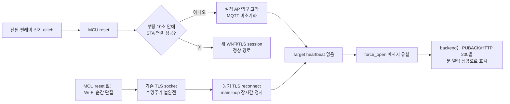

# Target 반복 reset·통신 단절 근본 원인 감사

> 감사 기준: 배포 firmware `2.0.0-g8eb7cac`, source `main` commit `707ca23`, 2026-07-31 01:34~02:19 KST
>
> 범위: ESP32-C6 Target firmware, MQTT 전달, FastAPI backend, OTA 배포, 릴레이·초음파 전기 경계
>
> 01:34~02:19 원격 관측 뒤 v2.1 진단·안전 firmware 수정이 이어졌다. 배포 전/후 사실을 구분한다.

## 1. 결론

**Target은 MQTT 단절만 겪은 것이 아니라 MCU가 사람의 조작 없이 적어도 세 번 새로 부팅됐다.**

| boot 추정 시각 (KST) | 근거 | 직전 boot와 간격 |
|---|---|---|
| 01:40:39 | 첫 live status의 uptime 277초 | 최초 관측 |
| 01:51:07 | 앞서 uptime 458초까지 본 뒤 새 표본이 166초 | 약 10분 28초 |
| 02:06:26 | 연속 감시에서 uptime 919→7 regression | 약 15분 19초 |

세 번째 reset은 12분 연속 감시 중 직접 포착했다. reset 직전까지 `state=IDLE`,
RSSI `-57~-58 dBm`, free heap `200,648 B`였고 heartbeat가 정상적으로 이어졌다. 그 뒤 8.288초
공백, `connected` event, uptime 7초가 순서대로 나타났다. 같은 감시 client가 구독한
`smart-gatekeeper/cmd`, `gatekeeper/arm`, `gatekeeper/force_open`에는 메시지가 한 건도 없었다.
후속 wildcard 감사에서도 retained command/config 입력은 없고 `gatekeeper/config/state`만
retained였다.

사용자는 세 reset 시점에 전원 재인가, reboot, OTA, provisioning 조작을 하지 않았다고 확인했다.
두 번째/세 번째 boot의 RSSI는 약 `-58 dBm`으로 양호했고 reset 직전 heap도 일정했으므로
**약한 Wi-Fi와 누적 heap 고갈은 세 번째 MCU reset의 직접 원인에서 제외한다.** 현재 가장 유력한
축은 software panic이며, 전원 순간 강하/brownout/EN glitch, GPIO11 ECHO 과전압 또는 GPIO23
역주입은 별개의 reset을 일으킬 수 있는 물리 위험으로 남는다.
MQTT 밖의 `/save` 호출은 논리상 남지만 반복 시각·정상 credential 유지와 맞지 않아 후순위다.

v2.1 OTA 뒤 flash에 남아 있던 coredump를 원격으로 읽어 **적어도 한 번의 reset은 software
panic이었음이 확정됐다.** panic은 `loopTask`에서
`udp_new_ip_type ... (Required to lock TCPIP core functionality!)` assertion으로 발생했다.
다만 coredump는 non-panic reset 뒤에도 남으므로 이것이 위 세 reset 중 정확히 어느 사건인지,
세 사건 모두 같은 원인인지는 아직 단정하지 않는다.

따라서 이번 사건은 “현재도 broker가 끊겨 있음”이 아니라 **정상 heartbeat 중 MCU가 갑자기
reset되고 새 부팅으로 복귀하는 반복 사건**이다. 최초 통신 고착은 reset과 별개 사건일 수 있다.
다음 코드 결함 때문에 같은 사건이 반복되거나
재부팅 조건에 따라 영구 offline으로 확대될 수 있다.

1. 초기 감사 시점에 공인 MQTTS endpoint의 TLS session과 MQTT CONNACK은 성공했지만, 감사 subscriber는
   Target이 정상 연결 중이면 1초마다 나와야 하는 `smart-gatekeeper/status` heartbeat를 관측하지 못했다.
   이후 새 boot의 uptime과 heartbeat 복귀가 확인됐으므로 일시 장애였다는 해석이 강해졌다.
2. 부팅 중 Wi-Fi가 10초 안에 연결되지 않으면 Target은 `SmartGatekeeper-Setup` AP로 전환된 뒤
   **STA 재접속을 한 번도 하지 않고 MQTT도 초기화하지 않는다.** 이 상태는 재부팅/재설정 전까지
   영구 지속된다.
3. 정상 부팅 뒤 Wi-Fi가 끊겨도 기존 TLS/MQTT socket을 즉시 폐기하지 않는다. Wi-Fi만 돌아오고
   MQTT socket은 stale 상태로 남을 수 있다.
4. TLS 연결은 relay safety FSM보다 먼저 같은 Arduino `loop()`에서 동기 실행된다. 현재 로컬
   framework의 TLS handshake 기본 timeout은 120초인데 코드의 `client.setSocketTimeout(15)`는
   이 timeout을 바꾸지 않는다. TCP connect와 MQTT CONNACK 대기까지 합치면 한 번의 동기 attempt가
   더 길 수 있어 네트워크 장애가 1초 relay cutoff까지 수십~수백 초 지연시킬 수 있다.
5. relay 상태 전이가 다른 명령이나 Pre-arm 만료에 덮이면 `relayOff()` 경로를 영구히 잃는다.
   릴레이 코일의 장시간 통전은 전원 강하·노이즈·열 문제를 확대해 다시 통신 장애를 만들 수 있다.
6. backend는 broker PUBACK을 Target 동작 성공으로 오인하고, `/door/open`은 MQTT 발행 실패도
   HTTP 200과 “문이 성공적으로 열렸습니다”로 반환한다.
7. 배포 firmware에는 reset reason, boot ID/count, 이전 state/action, relay 실제 GPIO, coredump
   summary, retained LWT가 없어 brownout과 panic을 원격에서 구분할 수 없다.
   **이 관측 불가능성 자체가 반복 장애를 방치한 시스템 근본 결함이다.**

가장 설득력 있는 반복 장애 사슬은 다음과 같다.



## 2. 망 구성과 감사 한계

- 개발 PC는 4층 사용자 댁 망, Target은 1층 현관 망에 있다.
- 따라서 개발 PC의 사설 IP 대역 ping, ARP, Wi-Fi scan은 Target 상태 증거가 될 수 없다.
  감사 중 얻은 로컬 서브넷 결과는 모두 판정에서 제외했다.
- 개발 PC에 Target USB serial 연결도 없다. 현재 firmware에는 원격 reset reason 보존 기능도 없다.
- 원격에서 유효한 증거는 공인 backend/MQTT endpoint, broker topic, 저장소 코드와 배포 metadata뿐이다.

## 3. 2026-07-31 원격 관측

| 관측 | 결과 | 판정 |
|---|---|---|
| `https://tworimpa.synology.me:4442/health` | HTTP 200, service healthy | API process가 응답한다는 뜻일 뿐 MQTT/Target health가 아님 |
| 초기 `smart-gatekeeper/status` 8초 구독 | 감사 client 관측 0건 | 초기 장애 정황; 이 측정은 SUBACK raw를 보존하지 않음 |
| 01:44 검증 구독 | certificate+hostname 검증, CONNACK 0, SUBACK QoS 1, 12초 11건 | 같은 공인 listener에서 Target heartbeat 복귀 확인 |
| 01:45 안정성 표본 | 20초 19건, 최대 gap 1.134초 | 짧은 관측창에서는 안정 |
| 01:48 추가 표본 | 30초 29건, 최대 gap 1.118초, 2초 초과 0회 | uptime regression/reboot 없이 연결 유지 |
| Target uptime | 분리 표본에서 277초 → 458초, regression 0 | 약 01:40:39 KST 새 boot로 추정 |
| live Target 상태 | `g8eb7cac`, IDLE, unarmed, heap 200,568 B | 현재 heap pressure 증거 없음 |
| live Wi-Fi RSSI | 30초 min -85, max -78, avg -81.6 dBm | 짧은 표본은 안정이나 RF margin이 낮은 실제 위험 |
| 01:54 두 번째 boot 확인 | uptime 166→175초, heap 200,612 B, RSSI -57~-56 | 약 01:51:07 KST 새 boot; 첫 boot와 10분 28초 |
| 01:55~02:07 연속 감시 | status 678건, reset 직전 uptime 919초/heap 200,648 B/RSSI -58 | 정상 heartbeat 중 MCU reset 직접 포착 |
| 02:06 세 번째 boot | uptime 919→7, heartbeat gap 8.288초 뒤 `connected` | 약 02:06:26 KST 새 boot; 두 번째와 15분 19초 |
| 동시 control topic | cmd/arm/force-open 0건, event는 재접속 `connected` 1건 | 세 번째 reset의 MQTT 명령 원인 강하게 반박 |
| retained wildcard 감사 | retained는 `gatekeeper/config/state`뿐, command/config 입력 0건 | retained destructive/config command 배제 |
| 세 번째 boot 후 status | IP `192.168.0.190`, RSSI -58, heap 200,568 B, IDLE | reset 뒤 정상 Wi-Fi/MQTT 복귀 |
| `gatekeeper/config/state` | 과거 retained payload 수신 | broker에 과거 Target 상태는 남아 있으나 현재 online 증거는 아님 |
| retained HA discovery의 firmware | `2.0.0-g8eb7cac` | Target이 마지막으로 광고한 build ID; `g707ca23`까지 Target source diff는 없음 |
| NAS OTA `version.json` | `2.0.0-g707ca23` | NAS가 최신 version metadata를 제공; binary/Target 설치 완료 증거는 아님 |

`src/main.cpp:379-388`은 MQTT가 연결돼 있으면 매 1초
`MqttManager::publishTelemetry()`를 호출한다. `src/MqttManager.cpp:528-548`의 status publish는
non-retained라서 8초 동안 0건이라는 결과는 “과거 retained 값이 없다”가 아니라
**감사 client가 그 세션에서 live heartbeat를 관측하지 못했다**는 뜻이다. 초기 측정은 SUBACK raw를
보존하지 않았지만, 후속 측정은 certificate/hostname 검증, CONNACK, SUBACK QoS 1을 모두 확인했다.
12초 11건과 이어진 20초 19건으로 current online이 확정됐고 firmware telemetry도 retained가 아닌
live message에서 읽었다. 그럼에도 초기 무수신의 정확한 시작 시각·disconnect reason과 약 01:40 새
boot의 reset reason은 남아 있지 않아 최초 trigger는 확정할 수 없다.

첫 boot 직후 평균 RSSI `-81.6 dBm`은 최초 통신 단절을 설명할 수 있는 요인이지만, 두 번째와
세 번째 boot에서는 `-58 dBm`이었고 세 번째 reset 직전까지 heartbeat도 정상이었다. 따라서 RF
문제는 **통신 단절/복구 실패 원인**으로 유지하되 **MCU reset 원인**과 합치지 않는다.

### 3.1 반복 reboot 원인 후보 축소

project source 전체에서 의도적으로 `ESP.restart()`를 호출하는 경로는 세 곳이다.

| 코드 | 조건 |
|---|---|
| `src/MqttManager.cpp:163-165` | MQTT `smart-gatekeeper/cmd`의 `reboot` 수신 |
| `src/OtaManager.cpp:112` | OTA update 성공 뒤 재부팅 |
| `src/WifiManager.cpp:219-237` | 무인증 `/save`에서 Wi-Fi credential 저장 뒤 재부팅 |

감사 client는 subscribe만 했고 위 command를 publish하지 않았다. 특히 세 번째 reset을 포함한
연속 감시에서 MQTT reboot/OTA/arm/force-open/config command가 없었다. 이 결과는 세 번째 사건의
MQTT 명령 원인을 강하게 반박한다. 과거 두 사건의 non-retained command는 broker audit log가 없어
소급 확정할 수 없다.

현재 로컬 Arduino-ESP32 3.3.9 core는 `loopTaskWDTEnabled=false`로 시작하며 project도
`enableLoopWDT()`를 호출하지 않는다. 따라서 동기 TLS block은 장시간 무응답을 설명하지만,
그 자체가 project loop watchdog reset으로 이어졌다는 증거는 없다. deployed core version은
고정 기록되지 않았으므로 watchdog을 완전히 배제할 수는 없지만 현재 우선순위는 다음과 같다.

1. 전원 순간 단절·3.3V brownout·EN glitch 또는 ECHO/relay GPIO 역주입
2. software panic/CPU lockup/driver assert
3. MQTT 밖의 unauthenticated provisioning `/save` 호출
4. 과거 두 사건에 한해 다른 MQTT/Home Assistant client의 일회성 reboot/OTA command
5. 기타 framework watchdog

성공 OTA는 세 boot 모두 firmware가 `g8eb7cac`으로 유지되어 반박된다. 고정 10~15분 restart
timer도 source에 없고 실제 간격 628초와 919초가 다르다. 세 boot의 heap baseline이
약 200.5 KB로 같고 세 번째 reset 직전에도 감소하지 않아 단순 누적 heap leak은 후순위다.

## 4. 확정 결함 1 — 부팅 Wi-Fi 실패 후 영구 AP 고착

### 4.1 코드 경로

| 순서 | 코드 | 동작 |
|---|---|---|
| 1 | `src/main.cpp:306` | `WifiManager::connectSTA(10000)`으로 딱 10초 대기 |
| 2 | `src/WifiManager.cpp:48-82` | 실패 시 `WiFi.disconnect(true, true)` 후 `false` 반환 |
| 3 | `src/main.cpp:306-331` | 성공 분기에서만 NTP, `MqttManager::init()`, OTA init 수행 |
| 4 | `src/main.cpp:328-330` | 실패하면 `startAP()` 진입 |
| 5 | `src/WifiManager.cpp:85-107` | `apModeActive=true`, 설정 AP 시작 |
| 6 | `src/WifiManager.cpp:273-297` | AP 분기에서는 DNS만 처리; STA retry는 `else` 분기에만 존재 |
| 7 | `src/main.cpp:337` | BLE advertiser는 Wi-Fi 결과와 무관하게 시작 |

즉 공유기 재부팅, 낮은 RSSI, DHCP 지연, 인증 지연 중 하나가 10초를 넘으면 다음 상태가
재현율 100%로 만들어진다.

- 스마트폰에는 iBeacon이 보일 수 있다.
- `SmartGatekeeper-Setup` AP도 보인다.
- 저장된 Wi-Fi로는 다시 시도하지 않는다.
- `WifiManager::connected`는 AP 분기에서 복구되지 않는다.
- MQTT는 초기화조차 되지 않는다.
- 원격 reboot/OTA 명령도 MQTT가 없으므로 받을 수 없다.

2026-07-30에 추가한 15초 `WiFi.reconnect()` watchdog은 **정상 STA 부팅 뒤**
`apModeActive == false`인 경우에만 동작하므로 이 경로를 고치지 못했다.
retained build `g8eb7cac`은 이 watchdog을 도입한 `a646c6b` 뒤의 commit이므로,
“최신 reconnect patch가 Target에 없어서” 생긴 문제가 아니라 patch 자체가 AP 분기를
복구하지 못하는 문제다.

### 4.2 현재 장애와의 관계

현장에서 `SmartGatekeeper-Setup` SSID가 보이면 AP interface가 활성화됐다는 강한 신호다.
다만 SSID 하나만으로 이 AP-trap을 확정할 수는 없다. `connectSTA()`는 성공 경로에서도
`WIFI_AP_STA`를 사용하고 `softAPdisconnect()` 또는 `WIFI_STA` 전환을 하지 않는다. 과거 저장된
AP 설정이 다시 활성화되면 STA/MQTT가 정상이어도 같은 SSID가 보일 가능성이 있기 때문이다.
SSID, 192.168.4.1 설정 화면 접근, MQTT heartbeat 부재, serial의 부팅 실패 로그를 결합해 판정해야 한다.

### 4.3 STA 성공 뒤 provisioning AP를 명시적으로 종료하지 않음

`src/WifiManager.cpp:58`은 정상 연결도 `WIFI_AP_STA`로 시작한다. 성공 분기에는 다음이 없다.

- `WiFi.softAPdisconnect(true)`
- `WiFi.mode(WIFI_STA)`
- DNS/AP interface 정리

따라서 과거 provisioning AP 설정이 남아 있으면 firmware의 `apModeActive=false`와 실제 radio
interface 상태가 어긋날 수 있다. 실제 재방송 여부는 현장 scan과 Arduino-ESP32 NVS 상태로
확인해야 한다.

이 cleanup 누락은 연결성뿐 아니라 보안 문제다.

- `startAP()`은 `WiFi.softAP("SmartGatekeeper-Setup", NULL, ...)`로 비밀번호 없는 AP를 만든다.
- WebServer `/save`는 인증 없이 새 SSID/password를 ConfigManager NVS에 쓰고 2초 뒤 reboot한다.
- root page는 load 때 `/scan`을 자동 호출하고, `/scan`은 인증 없이 동기 active scan을 실행해
  main loop와 shared 2.4GHz radio를 수 초간 방해할 수 있다.

정상 STA 경로에서도 이 AP가 남는다면 근처 사용자가 Wi-Fi 자격 증명을 바꿔 다음 boot를 AP-trap으로
보낼 수 있고, 반복 scan으로 Wi-Fi/BLE/MQTT 공존을 방해할 수 있다. provisioning은 물리 버튼으로
진입하고 짧은 시간만 열며 인증해야 한다. 성공 후에는 DNS와 SoftAP를 명시적으로 종료하고
pure `WIFI_STA`로 전환해야 한다.

## 5. 확정 결함 2 — Wi-Fi 복구와 MQTT socket 복구가 분리됨

`src/MqttManager.cpp:171-173`은 Wi-Fi가 끊기면 단순히 반환한다. 이때 다음을 하지 않는다.

- `client.disconnect()`
- `wifiClient.stop()`
- MQTT 상태 초기화
- Wi-Fi disconnect reason 기록
- IP 변경 감지

이후 `WifiManager`는 15초마다 `WiFi.reconnect()`만 부른다. Espressif의 ESP32-C6 Wi-Fi
가이드는 `WIFI_EVENT_STA_DISCONNECTED` 때 LwIP가 TCP/UDP connection을 제거해 socket이
잘못된 상태가 될 수 있으므로 application이 socket을 닫고 다시 만들 수 있다고 명시한다.
`IP_EVENT_STA_GOT_IP`는 socket을 만들 수 있는 시점이며 IP가 바뀌었으면 관련 socket을
재생성해야 한다.

현재 코드는 `WiFi.onEvent()`를 등록하지 않아 disconnect, lost-IP, got-IP 생애주기를 알지 못한다.
따라서 공유기 화면에서는 Target이 다시 DHCP 주소를 얻었어도 MQTT는 stale TLS session을
붙든 채 실패할 수 있다. 이는 확정된 cleanup/lifecycle 누락이지만 ESP network stack이나
`client.connected()`가 이후 오류를 감지해 재연결할 수도 있으므로 이번 장애 기여 여부는 미확정이다.

공식 근거:

- [ESP-IDF 5.5 ESP32-C6 Wi-Fi Driver — disconnect 시 socket 상태와 재생성](https://docs.espressif.com/projects/esp-idf/en/release-v5.5/esp32c6/api-guides/wifi.html)
- [Arduino-ESP32 Wi-Fi API — `onEvent`](https://docs.espressif.com/projects/arduino-esp32/en/latest/api/wifi.html#onevent-and-removeevent)

## 6. 확정 결함 3 — 동기 TLS reconnect가 전체 제어 loop를 정지

`src/MqttManager.cpp:188`의 `client.connect()`는 `src/main.cpp:350`에서 동기 실행된다.
호출 순서는 다음과 같다.

```text
WifiManager::handleClient()
MqttManager::update()          <- TLS connect/read/write가 여기서 block
초음파 측정
Pre-arm 만료
telemetry publish
relay FSM                     <- relayOff()는 맨 뒤에서야 실행
delay(100)
```

코드 주석은 `client.setSocketTimeout(15)`를 “TLS Handshake 대기 타임아웃 15초”라고 설명하지만
실제 의미가 다르다.

- 현재 개발 PC에서 resolve된 Arduino-ESP32 package: `3.3.9`
- 로컬 package `NetworkClientSecure.cpp` 기본 TCP timeout: 30,000 ms
- 같은 파일의 TLS handshake timeout: 120,000 ms
- handshake timeout은 `NetworkClientSecure::setHandshakeTimeout()`으로 별도 설정해야 함
- PubSubClient의 `setSocketTimeout(15)`는 MQTT packet read timeout만 15초로 설정

따라서 handshake 단계만으로 main loop가 120초 멈출 수 있다. 현재 로컬 dependency 조합에서는
TCP connect 30초 + TLS handshake 120초 + MQTT CONNACK read 15초가 순차로 걸릴 수 있어
DNS 시간을 빼도 단일 `client.connect()`가 약 165초에 접근할 가능성이 있다.
재시도 gate는 5초지만 timestamp를 connect 전에 기록하므로 handshake가 5초를 넘으면 반환 직후
다음 loop에서 거의 즉시 다시 시도할 수 있다. 3회 실패 뒤 `setInsecure()`로 바뀌기까지
반복 정지는 수분 단위가 될 수 있다.

단, `platformio.ini`가 versioned package URL이 아니라 가변 `stable` URL을 사용하고 build metadata에
실제 platform/framework version을 기록하지 않는다. 그러므로 물리 Target `g8eb7cac` artifact가
정확히 3.3.9였는지는 현재 저장된 metadata만으로 증명할 수 없다. “동기 connect가 safety loop를
막는다”는 결함은 version과 무관하게 확정이고, 165초는 현재 로컬 resolve 기준 상한 추정이다.

이 구조는 단순 통신 지연을 넘어 safety defect다.

- `RELAY_HOLD` 중 다음 loop의 reconnect가 block되면 예정된 1초 cutoff가 수십~수백 초 늦어진다.
- `publishEvent()`와 telemetry `publish()`도 반환값을 버린다.
- sensor 접근 경로는 `relayOn()` 직후 `publishEvent()`를 호출하고 그 뒤에야
  `state = RELAY_HOLD`를 기록한다. write block이 생기면 상태 전이 전부터 relay가 켜진 채 멈춘다.
- MQTT callback의 `ota_update`는 `OtaManager::checkAndUpdate(true)`를 동기 실행한다.
  relay hold 중 OTA command가 함께 처리되면 HTTP 확인·다운로드·flash update 동안 cutoff가 지연될 수 있다.

## 7. 확정 결함 4 — relay가 영구 ON으로 남을 수 있는 FSM

relay OFF는 `src/main.cpp:419-425`의 `GateState::RELAY_HOLD` case에만 있다.
별도의 relay deadline이나 independent timer가 없다.

### 7.1 `force_open` 뒤 `arm` 수신

1. `triggerManualDoorOpen()`이 relay ON, state를 `RELAY_HOLD`로 설정한다.
2. 1초 안에 `arm`이 오면 `triggerArm()`이 state를 무조건 `ARMED`로 덮어쓴다.
3. 이후 유효 거리 재감지가 없다면 `RELAY_HOLD` case에 다시 들어가지 않아 `relayOff()`가 호출되지 않는다.
   유효 거리가 다시 감지되면 relay를 또 ON한 뒤 새 `RELAY_HOLD`로 들어가 나중에 OFF될 수 있다.

### 7.2 이미 ARMED인 상태에서 `force_open`

1. 기존 `is_armed=true`와 `arm_timestamp`가 유지된다.
2. `triggerManualDoorOpen()`은 arm을 소비하거나 해제하지 않는다.
3. 기존 arm timeout이 1초 relay hold 안에 오면 `src/main.cpp:365-369`가 현재 state를 확인하지 않고
   `IDLE`로 덮어쓴다.
4. 다시 `RELAY_HOLD` case를 잃어 relay가 계속 ON이다.

### 7.3 네트워크 block

상태가 정상 `RELAY_HOLD`여도 다음 loop의 `MqttManager::update()`가 먼저 block되면 1초 cutoff를
제시간에 실행하지 못한다.

이 결함은 릴레이 코일 장시간 통전으로 steady load와 모듈 발열을 늘리고 RF peak 시 전원 여유를
줄여 통신 단절의 2차 원인이 될 수 있다. 큰 rail dip/overshoot는 보통 coil ON/OFF 전환 순간이
더 위험하다. 안전 cutoff는 상태 머신과 네트워크 loop에서 독립되어야 한다.

## 8. 확정 결함 5 — broker 수신을 Target 동작 성공으로 오인

### 8.1 Target MQTT session

- `src/MqttManager.cpp:188`의 3인자 `connect()`는 PubSubClient 2.8에서
  `cleanSession=true`를 사용한다.
- `src/MqttManager.cpp:193-202`의 인자 없는 `subscribe()`는 QoS 0이다.
- 명령 publish는 non-retained다.
- 모든 `subscribe()` 반환값을 무시하고 무조건 “토픽 구독 완료”라고 기록한다.
- PubSubClient의 `subscribe()` true도 SUBSCRIBE packet write 성공만 뜻하며 broker의 SUBACK grant를
  application에 노출하지 않는다. bool 검사만 추가해도 ACL 승인까지 증명되지는 않는다.
- command ID, expiry, Target ACK, 중복 방지가 없다.

따라서 Target이 offline이거나 구독 하나만 실패해도 그 순간 `force_open`은 소실된다.
강제 개방 명령을 reconnect 후 뒤늦게 실행하지 않는 것은 안전 측면에서 맞지만, 그 대신
“지금 online”과 “Target이 이 명령을 받음”을 application ACK로 확인해야 한다.

MQTT 3.1.1 규격상 Clean Session 1은 이전 session을 폐기한다. offline 중 QoS 1/2 메시지를
session에 보존하려면 persistent session이 필요하지만, 출입문 명령은 stale delivery가 위험하므로
`expires_at` 검증과 ACK를 함께 설계해야 한다.

- [OASIS MQTT 3.1.1 — Clean Session과 stored session](https://docs.oasis-open.org/mqtt/mqtt/v3.1.1/csd01/mqtt-v3.1.1-csd01.html)

### 8.2 backend의 거짓 성공

`backend/app/main.py:720-724`:

```python
force_ok = publish_force_open_to_mqtt(user_label)
return JSONResponse(
    content={
        "result": "force_opened",
        "message": "문이 성공적으로 열렸습니다!",
        "mqtt_published": force_ok,
    }
)
```

`force_ok == false`여도 HTTP 200과 성공 문구를 반환한다.
`backend/app/static/index.html:481-484`와 `admin.html:360-362`는 `res.ok`만 보고 성공을 표시한다.

`force_ok == true`여도 뜻은 broker가 publisher에게 PUBACK을 줬다는 것뿐이다.
다음을 증명하지 않는다.

```text
broker_accepted
    ≠ target_received
    ≠ relay_commanded
    ≠ relay_turned_off
    ≠ physical_door_opened
```

Target의 `force_opened` event도 QoS 0이고 publish 결과를 버리며 command ID가 없다.
backend는 event topic을 상시 구독하지 않으므로 현재는 ACK 역할도 하지 못한다.
향후 `relay_off` ACK를 추가해도 그것은 GPIO command 수행만 증명한다. 실제 relay contact와 문이
열렸는지는 door contact/reed switch 같은 별도 physical feedback sensor 없이는 증명할 수 없다.

### 8.3 잘못된 broker에 publish할 가능성

`backend/app/main.py:144-150`은 설정된 운영 broker보다 다음 local candidate를 먼저 시도한다.

1. `172.17.0.1:1883`
2. `172.22.0.1:1883`
3. `host.docker.internal:1883`
4. configured `MQTT_HOST:MQTT_PORT`
5. `127.0.0.1:1883`

앞선 endpoint가 PUBACK을 주면 configured 공인 MQTTS endpoint를 시도하지 않는다.
내부 1883과 공인 4883이 같은 Mosquitto instance의 서로 다른 listener일 수도 있으므로,
**앞선 endpoint가 Target과 다른 broker/session domain인 경우에만** 명령이 다른 곳으로 유실된다.
현재 저장소 설정도 Compose 1883/plain, `.env.example` 8883/TLS, firmware 4883/TLS로 갈라져 있다.
이는 현재 사고의 단독 원인으로 확인되지는 않았지만, 같은 증상을 만드는 확정된 설계 위험이다.

추가로 `_publish_mqtt_msg()`는 `socket.setdefaulttimeout(1.0)`으로 process-global default timeout을
바꾸고 복원하지 않으며, MQTT client ID가 초 단위 timestamp라 동시 요청이 같은 client ID로
서로 연결을 끊을 수 있다.

## 9. 확정 결함 6 — health와 배포가 실제 Target 상태를 보장하지 않음

### 9.1 `/health`

`backend/app/main.py:388-401`은 고정 JSON을 반환하며 다음을 검사하지 않는다.

- MQTT broker connect/publish
- Target availability
- 마지막 heartbeat 시각
- database query
- 실행 중 backend build SHA

따라서 API의 `healthy`는 이번 장애와 모순되지 않는다.

### 9.2 OTA 배포

`.github/workflows/deploy.yml:56-91`은 firmware binary와 `version.json`을 NAS에 SFTP upload할 뿐이다.
`src/OtaManager.cpp:15-17`의 `init()`은 update check를 하지 않는다. OTA는 Target이 MQTT
`ota_update`를 수신했을 때만 시작한다.

즉 다음은 서로 다른 상태다.

```text
GitHub build 성공
  -> NAS에 최신 firmware 존재
     -> Target이 MQTT ota_update 수신
        -> Target 다운로드/검증/재부팅 성공
           -> 실제 설치 완료
```

현재 retained discovery의 `g8eb7cac`과 NAS의 `g707ca23`은 build ID가 다르다. 다만
`git diff 8eb7cac..707ca23 -- src include platformio.ini` 결과는 비어 있어 두 commit 사이
Target firmware source 변경은 없다. 따라서 이 버전 차이가 이번 단절 원인이라는 증거는 아니다.
retained 값이 오래된 정보라 실제 실행 버전도 확정할 수 없다. 여기서 확정되는 것은
NAS upload만으로 Target update가 보장되지 않는 배포 구조이며, 이미 offline인 Target은
MQTT OTA 명령도 받을 수 없다는 점이다.

### 9.3 live backend revision도 확인 불가

backend 자동 배포 workflow는 과거 commit `6bddf33`에서 제거됐다. NAS 운영 반영에는 수동
`git pull`과 container 재시작이 필요하다. Compose가 `./app`을 bind mount해도 Uvicorn은
`--reload`로 실행되지 않으므로 pull만으로 이미 실행 중인 Python process가 교체되지 않는다.
`/health`에는 build SHA가 없어 live backend가 현재 저장소의 `519648b` 이후 Pre-arm PUBACK
수정을 실행 중인지 원격 응답만으로는 알 수 없다. Force-open 거짓 성공은 현재 저장소 코드에서
확정되지만, NAS process의 exact revision은 별도 배포 로그/container 확인이 필요하다.

## 10. 현장 배선 확인이 필요한 높은 위험

아래는 코드와 전기 규격상 위험하지만 실제 현장 배선/파형을 측정하지 않아 이번 사고의
최초 방아쇠로 확정하지 않은 항목이다.

### 10.1 AJ-SR04T ECHO 5V 과전압

- `src/main.cpp:354-356`은 ARMED 여부와 무관하게 매 loop 초음파를 trigger한다.
- `src/UltrasonicSensor.cpp:25-50`은 최대 30ms `pulseIn()`을 사용한다.
- 100ms loop delay를 포함하면 대략 초당 7~10회 ECHO pulse가 GPIO11에 들어온다.
- ESP32-C6 datasheet의 3.3V DC characteristics에서 high-level input 상한은 `VDD + 0.3V`,
  즉 VDD 3.3V일 때 약 3.6V다.

AJ-SR04T ECHO가 실제 5V이고 divider/level shifter 없이 직결됐다면 상시 과전압으로
GPIO 손상, 입력 clamp/과전압 경로를 통한 역주입, latch-up/reset 가능성이 있다.

- [Espressif ESP32-C6 Datasheet — DC Characteristics](https://documentation.espressif.com/esp32-c6_datasheet_en.html)

### 10.2 relay GPIO23 High-Z와 전원/역기전력

`src/RelayController.cpp:48-61`의 Active-LOW 동작은 다음과 같다.

| 상태 | GPIO23 |
|---|---|
| ON | `OUTPUT LOW` |
| OFF | `INPUT` High-Z |

5V relay module 내부 pull-up이 GPIO23으로 직접 연결되는 구조라면 OFF 때 5V가 ESP32 쪽으로
역주입될 수 있다. relay coil flyback, 자동문 부하 noise, 공통 5V rail, 긴 배선도
brownout/reset/latch-up 후보이다. 과거 hard power-cycle이 필요했던 freeze 이력과도 일치하지만,
이번 사고 귀속에는 다음 실측이 필요하다.

- ECHO HIGH voltage
- GPIO23 OFF voltage/역전류
- relay ON/OFF 순간 5V·3.3V rail dip
- GPIO overshoot
- flyback diode/optocoupler/driver 실제 구성

## 11. 가능성이 낮거나 현재 증거가 반박하는 가설

| 가설 | 판정 |
|---|---|
| 공인 MQTT broker 전체 다운 | 감사 시점 TLS CONNECT 성공으로 반박됨 |
| firmware와 backend의 force-open topic 불일치 | 둘 다 `gatekeeper/force_open`으로 일치 |
| 정상 상태의 `client.loop()` 호출 간격 부족 | 약 100~130ms loop, keepalive 30초이므로 단독 원인 아님 |
| 개발 PC와 같은 LAN에서 Target IP가 안 보임 | 망이 분리되어 있으므로 의미 없는 관측; 판정에서 제외 |
| `g8eb7cac`에 최신 Wi-Fi watchdog이 없음 | 해당 build가 watchdog commit `a646c6b` 뒤이므로 반박됨 |

## 12. 원인 신뢰도

| 등급 | 항목 | 현재 판정 |
|---|---|---|
| 확정 — live | 01:44~01:48 verified SUBACK 뒤 12초 11건, 20초 19건, 30초 29건 | 현재 Target MQTT online, 짧은 표본에서 2초 초과 gap 없음 |
| 확정 — live | uptime 277→458초 | 약 01:40:39 새 boot; reset 원인은 telemetry에 없음 |
| 확정 — live | RSSI -85~-78 dBm, 평균 -81.6 dBm | 현재 가장 구체적인 통신 불안 요인 |
| 관측 — live | 새 boot 전 초기 8초 heartbeat 관측 0건 | 일시 장애와 일치; 초기 측정은 SUBACK raw 미보존 |
| 확정 — code | 부팅 10초 실패 후 AP 영구 고착/MQTT 미초기화 | 최우선 지속 장애 원인 |
| 확정 — code | Wi-Fi disconnect 때 TLS socket 미폐기 | 자동 복구 실패 가능성을 높임; 이번 기여 미확정 |
| 확정 — code | 동기 TLS/MQTT connect가 main loop를 block | 현재 로컬 resolve는 handshake 120초, 전체 attempt 약 165초 가능; deployed exact version 미상 |
| 확정 — code | relay state overwrite로 OFF 경로 상실 | 장시간 coil 통전 가능 |
| 확정 — code | MQTT 발행/구독/ACK와 backend 성공 판정 결함 | 명령 유실을 성공으로 위장 |
| 확정 — code | NAS upload와 Target install 사이 자동 경로 없음 | 향후 firmware 변경 시 구버전 운용 가능; 현재 두 build의 Target source는 동일 |
| 유력 — hardware | ECHO 5V, relay 역주입/back-EMF, rail dip | 현장 측정 필요 |
| 미확정 | 이번 순간 장애의 최초 trigger | serial/reset/Wi-Fi reason 부재로 단정 불가 |

## 13. 현장에서 가장 빠른 판별 순서

1. 1층에서 휴대폰 Wi-Fi 목록에 `SmartGatekeeper-Setup`이 보이는지 확인한다.
   - 보이면 AP interface 활성 신호다. SSID 하나만으로 AP-trap을 확정하지 않는다.
   - 192.168.4.1 설정 화면 접근 + MQTT heartbeat 부재 + 부팅 실패 log를 함께 확인한다.
2. 일반 BLE scanner로 Gatekeeper iBeacon이 보이는지 확인한다.
   - beacon 있음 + MQTT heartbeat 없음: AP 고착 또는 Wi-Fi/MQTT 경로 문제
   - beacon 없음 + MQTT heartbeat 없음: 전원, freeze, reboot loop, RF stack 문제 우선
3. relay module LED/접점이 1초를 넘겨 계속 ON인지 확인한다.
   - 계속 ON이면 relay FSM overwrite 또는 main-loop blocking을 즉시 의심한다.
4. 현장 전원 재인가 전후로 MQTT heartbeat가 복귀하는지 기록한다.
   - hard power-cycle만 복구시키면 latch-up/전원/driver 위험도가 크게 올라간다.
5. 가능한 다음 방문에 USB serial 115200을 연결하고 부팅부터 끊길 때까지 로그를 보존한다.
   현재 코드는 reset reason을 출력하지 않으므로 수정 후 재현 시험이 필요하다.

## 14. 수정 우선순위

### P0 — 안전과 자기 복구

1. 1층 AP 위치·채널·안테나·중계 구성을 현장 survey해 현재 평균 -81.6 dBm RF link를 개선하고
   RSSI/재접속 횟수 alert를 둔다.
2. AP+STA provisioning 상태에서도 저장된 자격 증명으로 지수 backoff 재접속한다.
3. provisioning은 물리 버튼·짧은 timeout·인증으로 제한하고, `GOT_IP` event에서 MQTT를
   idempotent하게 초기화한 뒤 AP/DNS를 종료해 pure STA로 전환한다.
4. `DISCONNECTED`/`LOST_IP`에서 MQTT/TLS socket을 즉시 닫고 reason을 기록한다.
5. TLS connection/handshake timeout을 명시하고 network 작업을 relay FSM과 다른 task/queue로 분리한다.
6. relay OFF deadline을 FSM과 무관한 `esp_timer` 또는 hardware monostable로 보장한다.
7. manual open 때 기존 arm을 소비하고 `RELAY_HOLD` 중 `arm`이 state를 덮지 못하게 한다.
8. ECHO level shifting와 relay driver/전원 절연을 현장에서 확인하기 전 무인 반복 운용을 중단한다.

### P0 — 전달 증명

1. retained LWT `online/offline`과 heartbeat `last_seen`을 구현한다.
2. `command_id`, `issued_at`, `expires_at`을 명령에 포함한다.
3. Target ACK를 `received -> relay_on -> relay_off` 단계로 발행하고 backend가 timeout까지 기다린다.
4. `/door/open`은 publish 실패, Target offline, ACK timeout에 각각 503/504를 반환한다.
5. hard-coded broker fallback을 제거하고 검증된 단일 broker URI를 사용한다.
6. 모든 subscribe/publish 반환값과 MQTT state를 검사한다.

### P1 — 원인 보존

1. `esp_reset_reason()`, boot count, minimum free heap을 NVS/RTC와 telemetry에 남긴다.
2. Wi-Fi event/reason, DHCP IP 변경, MQTT connect/subscribe 결과를 구조화 로그로 보낸다.
3. backend `/health`를 API, DB, broker, Target last-seen으로 분리한다.
4. 실행 중 Target firmware SHA와 backend build SHA를 노출한다.
5. OTA를 “NAS upload”가 아니라 Target install/boot confirmation까지 추적한다.

## 15. 수정 후 합격 기준

| 시험 | 합격 조건 |
|---|---|
| 공유기 OFF 상태로 Target boot 후 2분 뒤 공유기 ON | 사용자 개입 없이 STA/MQTT 복귀 |
| Wi-Fi 30초 차단 후 복구 20회 | 매회 새 TLS session, 필수 topic 재구독, heartbeat 복귀 |
| broker 10분 차단 | relay/sensor loop는 block되지 않고 backoff reconnect |
| `force_open` 직후 `arm` 동시 전송 1,000회 | relay ON은 매회 설정 시간 이내 OFF |
| ARMED 만료 경계에서 `force_open` 1,000회 | relay OFF 누락 0회 |
| Target offline 중 force-open | API가 즉시 offline/timeout 실패, UI 성공 표시 금지 |
| command ACK 유실 | broker PUBACK만으로 성공 판정하지 않음 |
| stale command reconnect | `expires_at` 지난 개방 명령 폐기 |
| relay 분리 network soak 24시간 | unrecovered disconnect 0회, 모든 일시 단절이 정한 SLA 안에 자동 복구 |
| relay 100회 반복 + oscilloscope | rail dip/overshoot가 규격 내, heartbeat/advertising 유지 |

## 16. v2.1 원격 진단·안전 firmware 변경

Target이 벽에 매립돼 serial/coredump를 즉시 읽기 어렵다는 운영 조건에 맞춰 다음 OTA부터
reset 한 번으로 원인을 원격 판별할 수 있게 변경했다.

### 16.1 retained boot/availability

- `smart-gatekeeper/boot` retained JSON
  - full eFuse 기반 `target_id`, 매 boot random `boot_id`, NVS `boot_count`
  - `esp_reset_reason()` 이름/코드
  - OTA, MQTT reboot, provisioning-save가 미리 기록한 `planned_restart`
  - RTC no-init breadcrumb의 직전 uptime/state/action/armed/relay command/pin level
  - flash coredump 유효성, panic reason, task, exception PC, RISC-V `mcause`/`mtval`,
    crashing ELF SHA
  - Arduino core/IDF version, BSSID/channel/RSSI, heap minimum/largest block,
    loop stack high-water, MQTT attempt/failure
- `smart-gatekeeper/availability` retained online + broker LWT offline
- 기존 `smart-gatekeeper/status`에도 target/boot/reset/relay/heap/stack/BSSID/MQTT 필드를 추가
- event payload에도 target/boot ID를 넣어 공용 topic에서 보드와 boot를 구분

OTA 직후 reset은 `planned_restart=ota_update`, `reset_reason=SOFTWARE`로 보여야 한다.
그 상태에서 기존 coredump가 유효하면 이번 OTA 전 panic의 summary도 즉시 원격 회수할 수 있다.
이후 비계획 reset은 다음처럼 판정한다.

| telemetry | 판정 |
|---|---|
| `reset_reason=BROWNOUT` 또는 `POWER_GLITCH` | 전원 rail/EN/GPIO 전기 문제 확정 |
| `PANIC`/`CPU_LOCKUP` + valid coredump | panic reason/task/PC를 matching ELF로 해석 |
| `*_WDT` | 해당 watchdog과 직전 RTC breadcrumb 조사 |
| `SOFTWARE` + `planned_restart=mqtt_reboot/ota_update/provisioning_save` | 의도된 reset |
| `SOFTWARE` + `planned_restart=none` | 미계측 restart 경로 또는 framework reset 조사 |
| `POWERON` + planned 없음 | 완전 전원 단절/재인가 가능성 우선 |

### 16.2 relay·sensor fail-safe

- relay ON과 동시에 별도 `esp_timer` one-shot을 시작한다. main loop가 TLS/HTTP에서 block돼도
  timer task가 1초 후 GPIO를 OFF로 만든다.
- relay가 이미 ON이면 중복 open 명령이 기존 timer를 연장하지 못한다.
- loop의 elapsed-time OFF도 2차 방어로 유지한다.
- manual open은 기존 arm을 취소하고, relay가 ON/hold인 동안 새 arm은 거부한다.
- arm expiry가 `RELAY_HOLD` state를 덮지 않도록 ARMED 상태에서만 expiry를 적용한다.
- AJ-SR04T trigger는 IDLE 상시 7~10 Hz에서 Pre-arm 중으로 제한해 GPIO11 ECHO 과전압 노출과
  순간 부하를 크게 줄인다. 실제 ECHO level shifting 필요성은 그대로 남는다.

### 16.3 provisioning reset 차단

- 정상 연결은 pure `WIFI_STA`로 전환하고 SoftAP를 명시적으로 종료한다.
- Wi-Fi credential `/save`는 provisioning AP mode가 아니면 HTTP 403으로 거부한다.
- 허용된 `/save`, MQTT reboot, 성공 OTA는 재부팅 직전에 planned reason을 NVS/RTC에 기록한다.

이 변경은 원격 판별력과 software fail-safe를 높이지만 5V ECHO 직결, relay module 역주입,
전원 rail transient 같은 물리 위험을 제거하지 않는다. reset reason이 brownout/power glitch로
나오거나 새 firmware에서도 reset이 지속되면 다음 현장 작업은 level shifter/분압과 절연 relay
driver·전원 경로 점검이다.

## 17. v2.1 OTA 결과와 lwIP panic 제거

### 17.1 배포·원격 부팅 확인

- GitHub Actions run `30566577543`에서 ESP32-C6 build, NAS SFTP, 공개 version metadata 검증이
  모두 성공했다.
- Target에 OTA 명령을 non-retained QoS 1로 한 번 발행했고 PUBACK을 확인했다.
- Target status가 `2.0.0-g8eb7cac`에서 `2.1.0-g93cee8d`로 바뀌고 uptime이 새로 시작해 실제
  설치와 재부팅까지 확인했다.
- 새 boot identity는 `target_id=c0feffe6ebac`, `boot_id=2660ec9bffe6ebac`,
  `boot_count=1`, reset reason은 OTA에 따른 `SOFTWARE`였다.

### 17.2 과거 coredump에서 확인된 panic

retained boot payload가 이전 flash coredump 11,044 bytes를 valid로 판정했다.

| 필드 | 값 |
|---|---|
| panic task | `loopTask` |
| panic reason | `assert failed: udp_new_ip_type ... (Required to lock TCPIP core functionality!)` |
| exception PC | `0x4080EB28` |
| RISC-V cause/value | `mcause=2`, `mtval=0` |
| crashing ELF SHA prefix | `765974b7b` |

구 firmware의 project-level raw UDP 시작점은 정상 Wi-Fi 분기의 SNTP `configTime()`과
Wi-Fi 실패 분기의 captive `DNSServer::start()` 두 곳뿐이다. 둘 다 Arduino loop task에서
초기화되고 출입 제어에는 필요하지 않다. exact call stack이 보존되지 않아 둘 중 하나만 지목하는
대신 두 경로를 모두 제거한다.

- Target은 wall-clock을 기능에 사용하지 않으므로 SNTP 초기화와 최대 10초 동기화 대기를 제거한다.
- provisioning AP는 WebServer와 `192.168.4.1` 직접 접속만 유지하고 captive DNS를 제거한다.
- AP 시작/성공/실패를 RTC breadcrumb action에 기록한다.
- CI는 매 build의 `firmware.map`을 30일간 Actions artifact로 보존한다. ELF에는 운영 secret이
  포함될 수 있어 public artifact로 올리지 않는다.

이 조치는 확인된 `udp_new_ip_type` panic의 project-level 진입 경로를 닫는다. 다음 비계획
reset이 생기면 새 `reset_reason`, planned marker, RTC breadcrumb, coredump와 동일 build의
symbol map을 결합해 software와 전기 원인을 분리한다.
